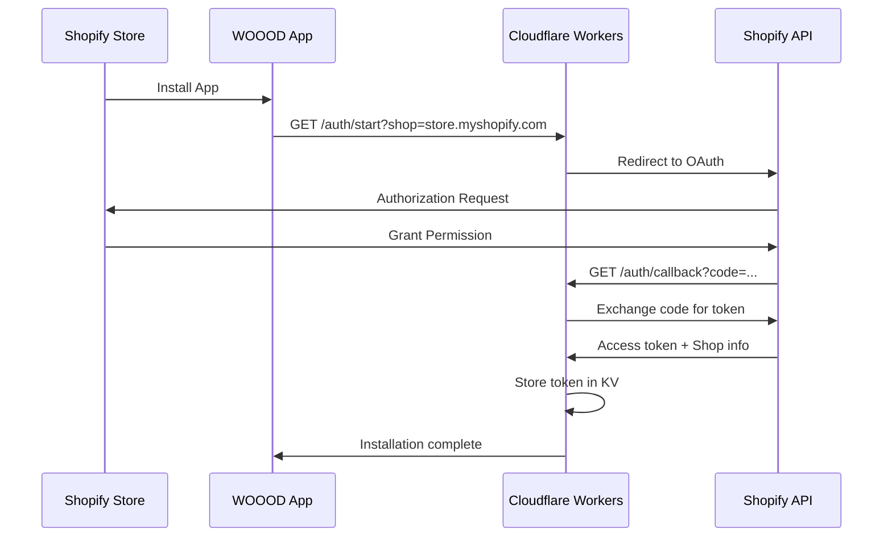

# Authentication Guide

> Complete authentication and authorization documentation for the WOOOD Delivery Date Picker system.

## 🔐 Authentication Overview

The WOOOD Delivery Date Picker uses a simplified, high-performance authentication system designed for enterprise security:

- **OAuth 2.0** for Shopify app installation and shop authentication
- **Simple Token Storage** using Cloudflare KV for secure access token storage
- **Role-Based Access Control** for different API endpoint protection levels
- **HMAC Signature Validation** for webhook authentication

## 🎯 Authentication Matrix

Different endpoints require different authentication levels:

| Authentication Type | Description | Use Cases |
|---------------------|-------------|-----------|
| `none` | Public access | Health checks, documentation |
| `token` | OAuth token required | Delivery dates, shipping methods |
| `token_admin` | Admin token required | Feature flags, system monitoring |
| `webhook` | HMAC signature required | Shopify webhook endpoints |

## 🚀 OAuth 2.0 Implementation

### OAuth Flow Overview



### Starting OAuth Flow

**Endpoint**: `GET /auth/start`

```http
GET /auth/start?shop=your-shop.myshopify.com
```

**Parameters**:
- `shop` (required): Shop domain (e.g., `your-shop.myshopify.com`)
- `embedded` (optional): Whether this is an embedded app installation

**Response**: Redirects to Shopify OAuth authorization URL

**Example**:
```bash
curl "https://woood-delivery-api.workers.dev/auth/start?shop=demo-shop.myshopify.com"
# Redirects to: https://demo-shop.myshopify.com/admin/oauth/authorize?...
```

### OAuth Callback Processing

**Endpoint**: `GET /auth/callback`

```http
GET /auth/callback?code=abc123&shop=your-shop.myshopify.com&state=xyz789
```

**Parameters** (automatically provided by Shopify):
- `code`: Authorization code from Shopify
- `shop`: Shop domain
- `state`: CSRF protection state value
- `hmac`: HMAC signature for verification

**Automatic Processing**:
1. Validates HMAC signature and state
2. Exchanges authorization code for access token
3. Stores access token in Cloudflare KV using SimpleTokenService
4. Registers mandatory webhooks
5. Completes installation

## 🔑 Token Management

### Token Structure

```typescript
interface ShopToken {
  accessToken: string;           // Shopify access token
  createdAt: string;             // Token creation timestamp
  shop: string;                  // Shop domain
}
```

### Token Storage

Tokens are stored in Cloudflare KV with automatic expiration:

```typescript
// Token storage with TTL (2 years)
await env.DELIVERY_CACHE.put(
  `shop_token:${shop}`,
  JSON.stringify(tokenData),
  { expirationTtl: 86400 * 365 * 2 }
);
```

### SimpleTokenService

The system uses a simplified token service for high performance:

```typescript
export class SimpleTokenService {
  async storeToken(shop: string, accessToken: string): Promise<void>
  async getToken(shop: string): Promise<string | null>
  async deleteToken(shop: string): Promise<void>
  async hasToken(shop: string): Promise<boolean>
  async listShopsWithTokens(): Promise<string[]>
}
```

## 🛡️ Token Authentication

### Authentication Headers

Include these headers in authenticated requests:

```http
X-Shopify-Shop-Domain: your-shop.myshopify.com
X-Request-ID: <uuid>
Content-Type: application/json
```

### Token Validation Process

1. **Extract Shop Domain**: From X-Shopify-Shop-Domain header or query parameters
2. **Lookup Token**: Retrieve access token from KV storage
3. **Validate Token**: Ensure token exists and is valid
4. **Verify Shop Domain**: Match against request headers

### Authentication Function

```typescript
async function authenticateRequest(
  request: Request,
  env: Env,
  logger: WorkersLogger,
  requestId: string
): Promise<{ success: boolean; shop?: string; accessToken?: string; error?: string }> {
  try {
    const url = new URL(request.url);
    const shop = url.searchParams.get('shop') || request.headers.get('X-Shopify-Shop-Domain');
    
    if (!shop) {
      return { success: false, error: 'Missing shop parameter' };
    }
    
    const tokenService = new SimpleTokenService(env);
    const accessToken = await tokenService.getToken(shop);
    
    if (!accessToken) {
      return { success: false, shop, error: 'No access token found for shop' };
    }
    
    return { success: true, shop, accessToken };
  } catch (error) {
    logger.error('Authentication failed', { requestId, error: error.message });
    return { success: false, error: 'Authentication failed' };
  }
}
```

## 🔐 Admin Authentication

### Admin Token Requirements

Admin endpoints require elevated permissions:

- **Valid OAuth token** with proper shop authentication
- **Admin scope verification** (currently any authenticated shop admin)
- **Enhanced security checks** with proper error handling

### Admin Access Validation

```typescript
export async function requireAdminAccess(
  request: Request,
  env: Env
): Promise<AdminAuthResult> {
  // First validate basic token
  const authResult = await authenticateRequest(request, env, logger, requestId);

  if (!authResult.success) {
    return { success: false, error: authResult.error };
  }

  // Verify admin permissions
  const isAdmin = await verifyAdminPermissions(authResult.shop);
  
  if (!isAdmin) {
    return { success: false, error: 'Admin access required' };
  }

  return { 
    success: true, 
    shop: authResult.shop, 
    accessToken: authResult.accessToken 
  };
}
```

## 🔒 Webhook Authentication

### HMAC Signature Validation

Webhook endpoints use Shopify's HMAC signature validation:

```typescript
async function verifyWebhookSignature(
  body: string,
  signature: string,
  secret: string
): Promise<boolean> {
  const expectedSignature = crypto
    .createHmac('sha256', secret)
    .update(body, 'utf8')
    .digest('base64');
    
  return crypto.timingSafeEqual(
    Buffer.from(signature),
    Buffer.from(expectedSignature)
  );
}
```

### Webhook Headers

Required headers for webhook authentication:

```http
X-Shopify-Hmac-Sha256: <hmac_signature>
X-Shopify-Shop-Domain: your-shop.myshopify.com
X-Shopify-Topic: orders/paid
Content-Type: application/json
```

## 🚨 Error Handling

### Authentication Errors

| Error Code | Description | Resolution |
|------------|-------------|------------|
| `AUTH_MISSING_SHOP` | Missing shop parameter | Include shop in query params or headers |
| `AUTH_NO_TOKEN` | No access token found | Re-authenticate via OAuth flow |
| `AUTH_INVALID_TOKEN` | Invalid or expired token | Re-authenticate via OAuth flow |
| `AUTH_ADMIN_REQUIRED` | Admin access required | Use admin OAuth flow |

### Error Response Format

```json
{
  "error": "AUTH_NO_TOKEN",
  "message": "No access token found for shop",
  "shop": "demo-shop.myshopify.com",
  "authUrl": "/auth/start?shop=demo-shop.myshopify.com",
  "timestamp": "2024-01-15T10:30:00Z"
}
```

## 🔄 Token Lifecycle

### Token Creation

1. **OAuth Installation**: Shop installs app via OAuth flow
2. **Token Exchange**: Authorization code exchanged for access token
3. **Token Storage**: Token stored in KV with shop as key
4. **Webhook Registration**: Mandatory webhooks registered

### Token Usage

1. **API Requests**: Shop domain used to lookup access token
2. **Shopify API Calls**: Access token used for authenticated requests
3. **Webhook Processing**: Token used for order processing

### Token Cleanup

1. **App Uninstall**: Token deleted when app is uninstalled
2. **Manual Cleanup**: Admin can manually remove tokens
3. **Expiration**: Tokens automatically expire after 2 years

## 🛡️ Security Considerations

### Token Security

- **No Encryption**: Tokens stored as-is in KV (Shopify tokens are already secure)
- **Shop Isolation**: Each shop has its own token key
- **Automatic Expiration**: Tokens expire after 2 years
- **No Session State**: Eliminates session corruption and race conditions

### Performance Benefits

- **No Decryption**: Eliminates CPU-intensive AES-GCM decryption
- **Simple Lookup**: Direct KV lookup by shop domain
- **No Fingerprinting**: Removes complex session fingerprinting
- **Reduced Complexity**: Simpler authentication flow

### Production Benefits

- **CPU Limit Compliance**: Eliminates CPU limit exceeded errors
- **Faster Response Times**: Reduced authentication overhead
- **Better Reliability**: No session corruption or race conditions
- **Simplified Debugging**: Clearer authentication flow

## 📋 Implementation Checklist

### For Developers

- [ ] Use `authenticateRequest()` function for token validation
- [ ] Pass shop domain in `X-Shopify-Shop-Domain` header
- [ ] Handle authentication errors with proper HTTP status codes
- [ ] Use SimpleTokenService for token operations

### For Operations

- [ ] Monitor token storage usage in Cloudflare KV
- [ ] Set up alerts for authentication failures
- [ ] Review token cleanup processes
- [ ] Monitor OAuth flow completion rates

### For Security

- [ ] Validate all webhook signatures
- [ ] Monitor for unauthorized access attempts
- [ ] Review token access patterns
- [ ] Ensure proper error handling without information leakage

## 🔍 Authentication Troubleshooting

### Common Issues

**❌ "Authentication Required"**
```bash
# Check session token is included
curl -H "Authorization: Bearer your_session_token" \
  https://api.woood.com/api/delivery-dates/available
```

**❌ "Invalid Session Token"**
- Session may have expired (24-hour limit)
- Session token may be corrupted
- Shop domain mismatch

**❌ "Session Fingerprint Mismatch"**
- User-Agent or IP address changed
- Request from different device/browser
- Potential security issue

**❌ "Admin Access Required"**
- Endpoint requires admin session
- Regular session used for admin endpoint
- Shop admin permissions not verified

### Authentication Testing

```bash
# Test session authentication
curl -X POST https://api.woood.com/api/delivery-dates/available \
  -H "Authorization: Bearer session_token_here" \
  -H "X-Shopify-Shop-Domain: demo-shop.myshopify.com" \
  -H "Content-Type: application/json" \
  -d '{"postal_code":"1234AB"}'

# Test admin authentication
curl -X GET https://api.woood.com/api/admin/feature-flags \
  -H "Authorization: Bearer admin_session_token" \
  -H "X-Shopify-Shop-Domain: demo-shop.myshopify.com"

# Test webhook authentication (invalid signature should fail)
curl -X POST https://api.woood.com/api/webhooks/orders/paid \
  -H "X-Shopify-Hmac-Sha256: invalid_signature" \
  -H "X-Shopify-Shop-Domain: demo-shop.myshopify.com" \
  -d '{}'
```

## 📞 Support

For authentication issues:

- **OAuth Problems**: Check [Installation Guide](../quick-start/installation.md)
- **Session Issues**: Review session token and shop domain
- **Webhook Authentication**: Verify webhook secret configuration
- **API Access**: See [API Reference](endpoints.md) for endpoint details

---

**🔒 Security Note**: Never log or expose session tokens, access tokens, or encryption keys. All authentication data is encrypted and stored securely.
