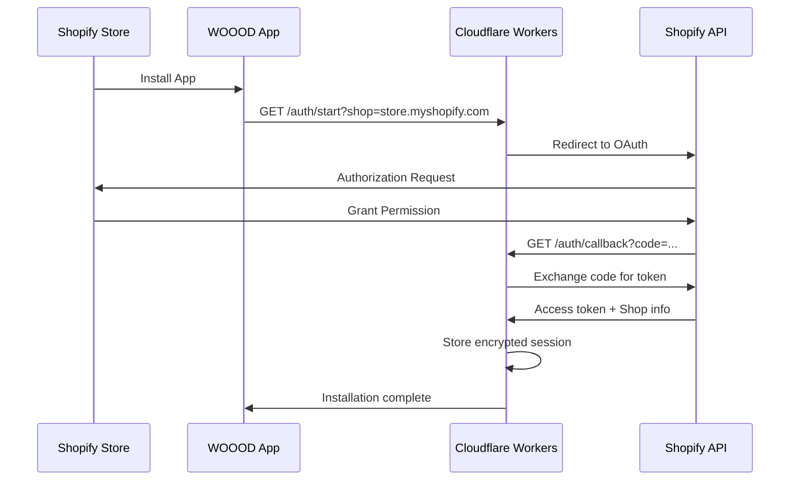

# Authentication Guide

> Complete authentication and authorization documentation for the WOOOD Delivery Date Picker system.

## 🔐 Authentication Overview

The WOOOD Delivery Date Picker uses a multi-layered authentication system designed for enterprise security:

- **OAuth 2.0** for Shopify app installation and shop authentication
- **Session Management** with AES-GCM encryption for secure token storage
- **Role-Based Access Control** for different API endpoint protection levels
- **HMAC Signature Validation** for webhook authentication

## 🎯 Authentication Matrix

Different endpoints require different authentication levels:

| Authentication Type | Description | Use Cases |
|---------------------|-------------|-----------|
| `none` | Public access | Health checks, documentation |
| `session` | OAuth session required | Delivery dates, shipping methods |
| `session_admin` | Admin session required | Feature flags, system monitoring |
| `webhook` | HMAC signature required | Shopify webhook endpoints |

## 🚀 OAuth 2.0 Implementation

### OAuth Flow Overview



### Starting OAuth Flow

**Endpoint**: `GET /auth/start`

```http
GET /auth/start?shop=your-shop.myshopify.com
```

**Parameters**:
- `shop` (required): Shop domain (e.g., `your-shop.myshopify.com`)
- `embedded` (optional): Whether this is an embedded app installation

**Response**: Redirects to Shopify OAuth authorization URL

**Example**:
```bash
curl "https://woood-delivery-api.workers.dev/auth/start?shop=demo-shop.myshopify.com"
# Redirects to: https://demo-shop.myshopify.com/admin/oauth/authorize?...
```

### OAuth Callback Processing

**Endpoint**: `GET /auth/callback`

```http
GET /auth/callback?code=abc123&shop=your-shop.myshopify.com&state=xyz789
```

**Parameters** (automatically provided by Shopify):
- `code`: Authorization code from Shopify
- `shop`: Shop domain
- `state`: CSRF protection state value
- `hmac`: HMAC signature for verification

**Automatic Processing**:
1. Validates HMAC signature and state
2. Exchanges authorization code for access token
3. Creates encrypted session with AES-GCM
4. Registers mandatory webhooks
5. Stores session in Cloudflare KV

## 🔑 Session Management

### Session Structure

```typescript
interface Session {
  id: string;                    // Unique session identifier
  shop: string;                  // Shop domain (e.g., demo-shop.myshopify.com)
  accessToken: string;           // Encrypted Shopify access token
  scope: string[];               // OAuth scopes granted
  expires?: Date;                // Session expiration
  isOnline: boolean;             // Online vs offline session
  state?: string;                // OAuth state for validation
  onlineAccessInfo?: {
    expires_in: number;
    associated_user_scope: string;
    associated_user: {
      id: number;
      first_name: string;
      last_name: string;
      email: string;
      locale: string;
    };
  };
}
```

### Session Encryption

Sessions are encrypted using **AES-GCM** with 256-bit keys:

```typescript
// Encryption process
const sessionData = JSON.stringify(session);
const key = await crypto.subtle.importKey(
  'raw',
  new TextEncoder().encode(env.API_ENCRYPTION_KEY),
  { name: 'AES-GCM' },
  false,
  ['encrypt', 'decrypt']
);

const iv = crypto.getRandomValues(new Uint8Array(12));
const encryptedData = await crypto.subtle.encrypt(
  { name: 'AES-GCM', iv },
  key,
  new TextEncoder().encode(sessionData)
);
```

### Session Fingerprinting

Each session includes a security fingerprint:

```typescript
interface SessionFingerprint {
  userAgent: string;             // Hashed User-Agent
  ipAddress: string;             // Hashed IP address
  shopDomain: string;            // Shop domain
  timestamp: number;             // Creation timestamp
}
```

### Session Storage

Sessions are stored in Cloudflare KV with automatic expiration:

```typescript
// Session storage with TTL
await env.WOOOD_KV.put(
  `session:${sessionId}`,
  encryptedSessionData,
  { expirationTtl: 86400 } // 24 hours
);

// Session fingerprint storage
await env.WOOOD_KV.put(
  `session_fingerprint:${sessionId}`,
  JSON.stringify(fingerprint),
  { expirationTtl: 86400 }
);
```

## 🛡️ Session Authentication

### Authentication Headers

Include these headers in authenticated requests:

```http
Authorization: Bearer <session_token>
X-Shopify-Shop-Domain: your-shop.myshopify.com
X-Request-ID: <uuid>
Content-Type: application/json
```

### Session Validation Process

1. **Extract Session Token**: From Authorization header, X-Session-ID header, query params, or cookies
2. **Decrypt Session**: Using AES-GCM with API encryption key
3. **Validate Fingerprint**: Check User-Agent, IP, and shop domain match
4. **Check Expiration**: Ensure session hasn't expired
5. **Verify Shop Domain**: Match against request headers

### Authentication Middleware

```typescript
export async function sessionAuthMiddleware(
  request: Request,
  env: Env
): Promise<SessionAuthResult> {
  // Extract session token from multiple sources
  const sessionToken = extractSessionToken(request);

  if (!sessionToken) {
    return { success: false, error: 'No session token provided' };
  }

  // Load and decrypt session
  const session = await sessionStorage.loadSession(sessionToken);

  if (!session) {
    return { success: false, error: 'Invalid session token' };
  }

  // Validate session fingerprint
  const fingerprintValid = await validateSessionFingerprint(session, request);

  if (!fingerprintValid) {
    return { success: false, error: 'Session fingerprint mismatch' };
  }

  return { success: true, session };
}
```

## 🔐 Admin Authentication

### Admin Session Requirements

Admin endpoints require elevated permissions:

- **Valid OAuth session** with proper shop authentication
- **Admin scope verification** (currently any authenticated shop admin)
- **Enhanced security checks** with shorter session timeouts

### Admin Access Validation

```typescript
export async function requireAdminAccess(
  request: Request,
  env: Env
): Promise<AdminAuthResult> {
  // First validate basic session
  const sessionResult = await sessionAuthMiddleware(request, env);

  if (!sessionResult.success) {
    return { success: false, error: sessionResult.error };
  }

  // Verify admin permissions
  const isAdmin = await verifyAdminPermissions(sessionResult.session);

  if (!isAdmin) {
    return { success: false, error: 'Admin access required' };
  }

  return { success: true, session: sessionResult.session };
}
```

## 🔗 Webhook Authentication

### HMAC Signature Validation

Webhooks use HMAC-SHA256 signature validation:

```typescript
export async function validateWebhookSignature(
  request: Request,
  env: Env
): Promise<boolean> {
  const signature = request.headers.get('X-Shopify-Hmac-Sha256');
  const body = await request.text();

  if (!signature || !body) {
    return false;
  }

  // Calculate expected signature
  const expectedSignature = await crypto.subtle.sign(
    'HMAC',
    await crypto.subtle.importKey(
      'raw',
      new TextEncoder().encode(env.WEBHOOK_SECRET),
      { name: 'HMAC', hash: 'SHA-256' },
      false,
      ['sign']
    ),
    new TextEncoder().encode(body)
  );

  // Compare signatures
  const expectedBase64 = btoa(String.fromCharCode(...new Uint8Array(expectedSignature)));
  return signature === expectedBase64;
}
```

### Webhook Headers

Shopify includes these headers in webhook requests:

```http
X-Shopify-Topic: orders/paid
X-Shopify-Hmac-Sha256: <signature>
X-Shopify-Shop-Domain: your-shop.myshopify.com
X-Shopify-API-Version: 2025-04
Content-Type: application/json
```

## 🚨 Security Best Practices

### Session Security

- **AES-GCM Encryption**: All sessions encrypted with 256-bit keys
- **Session Fingerprinting**: Prevents session hijacking
- **Automatic Expiration**: Sessions expire after 24 hours
- **Secure Storage**: Cloudflare KV with TTL management

### Token Management

- **No Hardcoded Secrets**: All secrets via Cloudflare Secrets
- **Token Rotation**: Regular rotation of encryption keys
- **Scope Limitation**: Minimal OAuth scopes: `read_products,read_orders,write_order_metafields`

### Request Validation

- **HTTPS Only**: All requests must use HTTPS
- **CORS Protection**: Strict origin validation
- **Rate Limiting**: Prevents abuse and DDoS
- **Input Sanitization**: All inputs validated and sanitized

## 🔍 Authentication Troubleshooting

### Common Issues

**❌ "Authentication Required"**
```bash
# Check session token is included
curl -H "Authorization: Bearer your_session_token" \
  https://api.woood.com/api/delivery-dates/available
```

**❌ "Invalid Session Token"**
- Session may have expired (24-hour limit)
- Session token may be corrupted
- Shop domain mismatch

**❌ "Session Fingerprint Mismatch"**
- User-Agent or IP address changed
- Request from different device/browser
- Potential security issue

**❌ "Admin Access Required"**
- Endpoint requires admin session
- Regular session used for admin endpoint
- Shop admin permissions not verified

### Authentication Testing

```bash
# Test session authentication
curl -X POST https://api.woood.com/api/delivery-dates/available \
  -H "Authorization: Bearer session_token_here" \
  -H "X-Shopify-Shop-Domain: demo-shop.myshopify.com" \
  -H "Content-Type: application/json" \
  -d '{"postal_code":"1234AB"}'

# Test admin authentication
curl -X GET https://api.woood.com/api/admin/feature-flags \
  -H "Authorization: Bearer admin_session_token" \
  -H "X-Shopify-Shop-Domain: demo-shop.myshopify.com"

# Test webhook authentication (invalid signature should fail)
curl -X POST https://api.woood.com/api/webhooks/orders/paid \
  -H "X-Shopify-Hmac-Sha256: invalid_signature" \
  -H "X-Shopify-Shop-Domain: demo-shop.myshopify.com" \
  -d '{}'
```

## 📞 Support

For authentication issues:

- **OAuth Problems**: Check [Installation Guide](../quick-start/installation.md)
- **Session Issues**: Review session token and shop domain
- **Webhook Authentication**: Verify webhook secret configuration
- **API Access**: See [API Reference](endpoints.md) for endpoint details

---

**🔒 Security Note**: Never log or expose session tokens, access tokens, or encryption keys. All authentication data is encrypted and stored securely.
