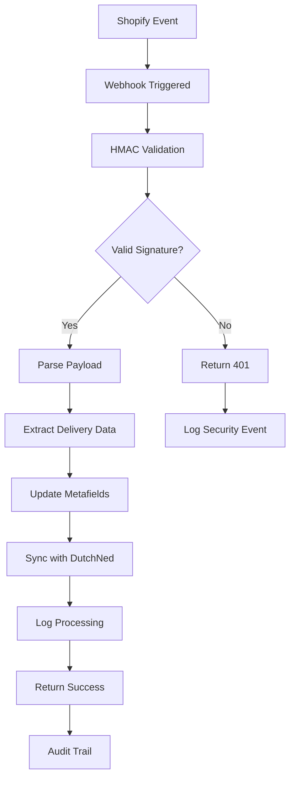

# Webhooks Guide

> Complete webhook integration documentation for the WOOOD Delivery Date Picker system.

## 🔄 Webhook Overview

The WOOOD Delivery Date Picker uses Shopify webhooks to process order events and maintain real-time synchronization with delivery scheduling and order management.

### Supported Webhooks

| Webhook Topic | Purpose | Handler | Priority |
|---------------|---------|---------|----------|
| `orders/paid` | Process new paid orders | `/api/webhooks/orders/paid` | High |
| `orders/updated` | Handle order modifications | `/api/webhooks/orders/updated` | Medium |
| `orders/cancelled` | Process order cancellations | `/api/webhooks/orders/cancelled` | Medium |
| `app/uninstalled` | Clean up app data | `/api/webhooks/app/uninstalled` | Critical |

## 🔐 Webhook Security

### HMAC Signature Validation

All webhooks use HMAC-SHA256 signature validation for security:

```typescript
export async function validateWebhookSignature(
  request: Request,
  env: Env
): Promise<boolean> {
  const signature = request.headers.get('X-Shopify-Hmac-Sha256');
  const body = await request.text();

  if (!signature || !body) {
    return false;
  }

  // Calculate expected HMAC signature
  const expectedSignature = await crypto.subtle.sign(
    'HMAC',
    await crypto.subtle.importKey(
      'raw',
      new TextEncoder().encode(env.WEBHOOK_SECRET),
      { name: 'HMAC', hash: 'SHA-256' },
      false,
      ['sign']
    ),
    new TextEncoder().encode(body)
  );

  const expectedBase64 = btoa(String.fromCharCode(...new Uint8Array(expectedSignature)));
  return signature === expectedBase64;
}
```

### Required Headers

Shopify includes these headers with webhook requests:

```http
X-Shopify-Topic: orders/paid
X-Shopify-Hmac-Sha256: <signature>
X-Shopify-Shop-Domain: your-shop.myshopify.com
X-Shopify-API-Version: 2025-04
X-Shopify-Webhook-Id: <unique-id>
Content-Type: application/json
User-Agent: Shopify-Captain-Hook
```

## 📋 Webhook Endpoints

### Orders Paid (`orders/paid`)

**Endpoint**: `POST /api/webhooks/orders/paid`

**Purpose**: Process newly paid orders and set up delivery scheduling

**Trigger**: When a customer completes payment for an order

**Payload Example**:
```json
{
  "id": 450789469,
  "email": "customer@example.com",
  "created_at": "2024-03-15T10:30:00-05:00",
  "updated_at": "2024-03-15T10:30:00-05:00",
  "number": 1001,
  "note": null,
  "total_price": "199.95",
  "subtotal_price": "199.95",
  "total_tax": "21.00",
  "currency": "EUR",
  "financial_status": "paid",
  "confirmed": true,
  "shipping_address": {
    "first_name": "John",
    "last_name": "Doe",
    "address1": "123 Main Street",
    "city": "Amsterdam",
    "province": "North Holland",
    "country": "Netherlands",
    "zip": "1234AB"
  },
  "line_items": [
    {
      "id": 866550311766439020,
      "product_id": 632910392,
      "variant_id": 39072856,
      "title": "WOOOD Dining Table",
      "quantity": 1,
      "price": "199.95",
      "properties": [
        {
          "name": "Delivery Date",
          "value": "2024-03-20"
        }
      ]
    }
  ]
}
```

**Processing Steps**:
1. Validate HMAC signature
2. Extract delivery date from line item properties
3. Create order metafields for delivery tracking
4. Update delivery schedule with DutchNed API
5. Send confirmation email (if enabled)

**Response**: `200 OK` with processing details

### Orders Updated (`orders/updated`)

**Endpoint**: `POST /api/webhooks/orders/updated`

**Purpose**: Handle order modifications that affect delivery

**Trigger**: When order details change (address, items, delivery date)

**Processing Logic**:
```typescript
export async function handleOrderUpdated(order: ShopifyOrder, env: Env) {
  // Check if delivery-related fields changed
  const deliveryFields = ['shipping_address', 'line_items'];
  const hasDeliveryChanges = checkFieldChanges(order, deliveryFields);

  if (!hasDeliveryChanges) {
    return { success: true, message: 'No delivery-related changes' };
  }

  // Extract new delivery date from properties
  const newDeliveryDate = extractDeliveryDate(order.line_items);

  if (newDeliveryDate) {
    // Update delivery schedule
    await updateDeliverySchedule(order.id, newDeliveryDate, env);

    // Update order metafields
    await updateOrderMetafields(order, env);

    // Log change for audit
    await logDeliveryChange(order.id, 'order_updated', newDeliveryDate, env);
  }

  return { success: true, delivery_date: newDeliveryDate };
}
```

### Orders Cancelled (`orders/cancelled`)

**Endpoint**: `POST /api/webhooks/orders/cancelled`

**Purpose**: Clean up delivery scheduling for cancelled orders

**Trigger**: When an order is cancelled

**Processing Steps**:
1. Validate webhook signature
2. Cancel delivery schedule with DutchNed
3. Remove order metafields
4. Log cancellation for tracking
5. Update capacity planning

**Response Example**:
```json
{
  "success": true,
  "order_id": 450789469,
  "delivery_cancelled": true,
  "capacity_released": true,
  "cleanup_completed": true
}
```

### App Uninstalled (`app/uninstalled`)

**Endpoint**: `POST /api/webhooks/app/uninstalled`

**Purpose**: Clean up all shop data when app is uninstalled

**Trigger**: When shop uninstalls the app

**Processing Steps**:
1. Validate webhook signature
2. Remove all shop sessions
3. Clear shop-specific KV data
4. Cancel all pending deliveries
5. Log uninstallation event

**Critical Operations**:
```typescript
export async function handleAppUninstalled(shop: string, env: Env) {
  try {
    // Remove all sessions for this shop
    await cleanupShopSessions(shop, env);

    // Clear all KV data for shop
    await cleanupShopData(shop, env);

    // Cancel pending deliveries
    await cancelAllDeliveries(shop, env);

    // Log uninstallation
    await logUninstallation(shop, env);

    return { success: true, shop, cleanup_completed: true };
  } catch (error) {
    // Critical: Log error but return success to prevent retries
    await logError('app_uninstalled_error', { shop, error: error.message }, env);
    return { success: true, error: 'Cleanup error logged' };
  }
}
```

## 🔧 Webhook Registration

### Automatic Registration

Webhooks are automatically registered during OAuth installation:

```typescript
export async function registerWebhooks(shop: string, accessToken: string, env: Env) {
  const webhooks = [
    {
      topic: 'orders/paid',
      address: `${env.APP_URL}/api/webhooks/orders/paid`,
      format: 'json'
    },
    {
      topic: 'orders/updated',
      address: `${env.APP_URL}/api/webhooks/orders/updated`,
      format: 'json'
    },
    {
      topic: 'orders/cancelled',
      address: `${env.APP_URL}/api/webhooks/orders/cancelled`,
      format: 'json'
    },
    {
      topic: 'app/uninstalled',
      address: `${env.APP_URL}/api/webhooks/app/uninstalled`,
      format: 'json'
    }
  ];

  for (const webhook of webhooks) {
    await createWebhook(shop, accessToken, webhook);
  }
}
```

### Manual Registration

For testing or manual setup, use Shopify Admin API:

```bash
# Create webhook via API
curl -X POST \
  https://your-shop.myshopify.com/admin/api/2025-04/webhooks.json \
  -H "X-Shopify-Access-Token: your_access_token" \
  -H "Content-Type: application/json" \
  -d '{
    "webhook": {
      "topic": "orders/paid",
      "address": "https://your-workers-domain.com/api/webhooks/orders/paid",
      "format": "json"
    }
  }'
```

### Webhook Verification

Verify webhook registration:

```bash
# List registered webhooks
curl -X GET \
  https://your-shop.myshopify.com/admin/api/2025-04/webhooks.json \
  -H "X-Shopify-Access-Token: your_access_token"
```

## 📊 Webhook Processing Pipeline

### Processing Flow



### Error Handling

```typescript
export async function processWebhook(
  topic: string,
  payload: any,
  request: Request,
  env: Env
): Promise<Response> {
  try {
    // Validate signature
    const isValid = await validateWebhookSignature(request, env);
    if (!isValid) {
      await logSecurityEvent('invalid_webhook_signature', { topic }, env);
      return new Response('Unauthorized', { status: 401 });
    }

    // Process webhook by topic
    let result;
    switch (topic) {
      case 'orders/paid':
        result = await handleOrderPaid(payload, env);
        break;
      case 'orders/updated':
        result = await handleOrderUpdated(payload, env);
        break;
      case 'orders/cancelled':
        result = await handleOrderCancelled(payload, env);
        break;
      case 'app/uninstalled':
        result = await handleAppUninstalled(payload.shop_domain, env);
        break;
      default:
        return new Response('Unknown webhook topic', { status: 400 });
    }

    // Log successful processing
    await logWebhookProcessing(topic, payload.id, result, env);

    return new Response(JSON.stringify(result), {
      headers: { 'Content-Type': 'application/json' }
    });

  } catch (error) {
    // Log error and return success to prevent retries
    await logError('webhook_processing_error', {
      topic,
      error: error.message,
      order_id: payload.id
    }, env);

    return new Response(JSON.stringify({
      success: false,
      error: 'Processing error logged'
    }), { status: 200 });
  }
}
```

### Retry Logic

Shopify retries failed webhooks with exponential backoff:

- **Retry Schedule**: 1s, 2s, 4s, 8s, 16s, 32s, 64s
- **Max Retries**: 19 attempts over ~48 hours
- **Success Response**: HTTP 200-299
- **Timeout**: 5 seconds

## 🔍 Webhook Testing

### Local Testing with ngrok

```bash
# Install ngrok
npm install -g ngrok

# Start local development
yarn dev

# Expose local server
ngrok http 8787

# Update webhook URLs to ngrok URL
curl -X PUT \
  https://your-shop.myshopify.com/admin/api/2025-04/webhooks/WEBHOOK_ID.json \
  -H "X-Shopify-Access-Token: your_access_token" \
  -d '{
    "webhook": {
      "address": "https://abc123.ngrok.io/api/webhooks/orders/paid"
    }
  }'
```

### Webhook Testing Tool

```typescript
// Test webhook endpoint manually
export async function testWebhook(
  topic: string,
  shop: string,
  env: Env
): Promise<Response> {
  const testPayloads = {
    'orders/paid': {
      id: 999999999,
      email: 'test@example.com',
      total_price: '99.99',
      shipping_address: {
        zip: '1234AB',
        country: 'Netherlands'
      },
      line_items: [{
        properties: [{ name: 'Delivery Date', value: '2024-03-25' }]
      }]
    }
  };

  const payload = testPayloads[topic];
  if (!payload) {
    return new Response('Unknown test topic', { status: 400 });
  }

  // Create test request with proper headers
  const testRequest = new Request('https://test.com/webhook', {
    method: 'POST',
    headers: {
      'X-Shopify-Topic': topic,
      'X-Shopify-Shop-Domain': shop,
      'X-Shopify-Hmac-Sha256': await generateTestSignature(payload, env),
      'Content-Type': 'application/json'
    },
    body: JSON.stringify(payload)
  });

  return processWebhook(topic, payload, testRequest, env);
}
```

### Manual Webhook Trigger

```bash
# Test orders/paid webhook
curl -X POST \
  https://your-workers-domain.com/api/webhooks/orders/paid \
  -H "X-Shopify-Topic: orders/paid" \
  -H "X-Shopify-Shop-Domain: test-shop.myshopify.com" \
  -H "X-Shopify-Hmac-Sha256: VALID_SIGNATURE" \
  -H "Content-Type: application/json" \
  -d '{
    "id": 999999999,
    "email": "test@example.com",
    "total_price": "99.99",
    "line_items": [{
      "properties": [{"name": "Delivery Date", "value": "2024-03-25"}]
    }]
  }'
```

## 📈 Webhook Monitoring

### Processing Metrics

Track webhook performance:

```typescript
interface WebhookMetrics {
  topic: string;
  processing_time_ms: number;
  success: boolean;
  error_code?: string;
  retry_count: number;
  timestamp: string;
}

export async function logWebhookMetrics(
  topic: string,
  startTime: number,
  success: boolean,
  env: Env
) {
  const metrics: WebhookMetrics = {
    topic,
    processing_time_ms: Date.now() - startTime,
    success,
    retry_count: 0,
    timestamp: new Date().toISOString()
  };

  await env.WOOOD_KV.put(
    `webhook_metrics:${Date.now()}`,
    JSON.stringify(metrics),
    { expirationTtl: 86400 * 7 } // 7 days
  );
}
```

### Health Monitoring

```bash
# Check webhook health
curl https://your-workers-domain.com/api/admin/system-health

# Response includes webhook metrics
{
  "webhooks": {
    "status": "healthy",
    "last_24h": {
      "total_processed": 150,
      "success_rate": 0.96,
      "avg_processing_time_ms": 245
    },
    "topics": {
      "orders/paid": { "count": 120, "success_rate": 0.97 },
      "orders/updated": { "count": 25, "success_rate": 0.92 },
      "orders/cancelled": { "count": 5, "success_rate": 1.0 }
    }
  }
}
```

## 🚨 Webhook Troubleshooting

### Common Issues

**❌ "Webhook signature validation failed"**
- Check webhook secret configuration
- Verify HMAC calculation implementation
- Ensure body is read as raw text

**❌ "Webhook endpoint timeout"**
- Optimize processing pipeline
- Use async processing for heavy operations
- Return response quickly, process in background

**❌ "Webhook not being called"**
- Verify webhook registration
- Check webhook URL accessibility
- Review Shopify webhook logs

### Debug Webhook Processing

```typescript
export async function debugWebhook(request: Request, env: Env) {
  const headers = {};
  request.headers.forEach((value, key) => {
    headers[key] = value;
  });

  const body = await request.text();

  const debug = {
    method: request.method,
    url: request.url,
    headers,
    body: body.substring(0, 1000), // First 1000 chars
    timestamp: new Date().toISOString()
  };

  console.log('Webhook Debug:', debug);

  return debug;
}
```

## 📞 Support

For webhook issues:

- **Registration Problems**: Check [Installation Guide](../quick-start/installation.md)
- **Authentication Issues**: Review [Authentication Guide](authentication.md)
- **Error Codes**: See [Error Codes Reference](error-codes.md)
- **API Reference**: View [Endpoints Documentation](endpoints.md)

---

**🔒 Security Note**: Always validate webhook signatures and never expose webhook secrets. Log all security events for audit purposes.
