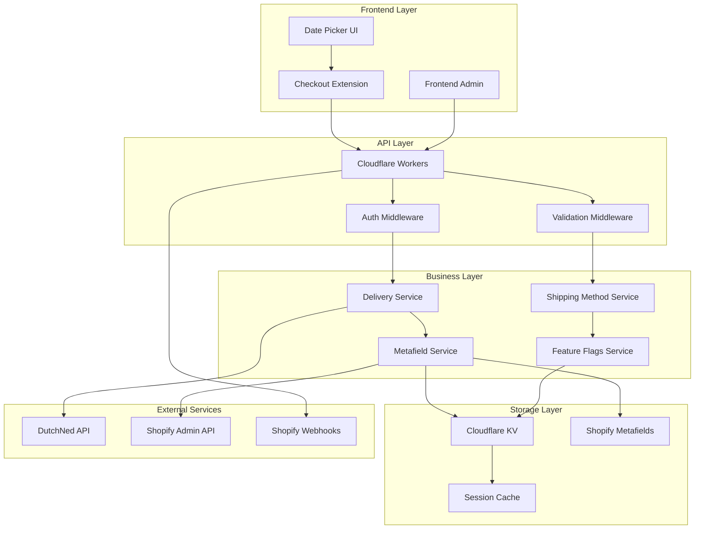
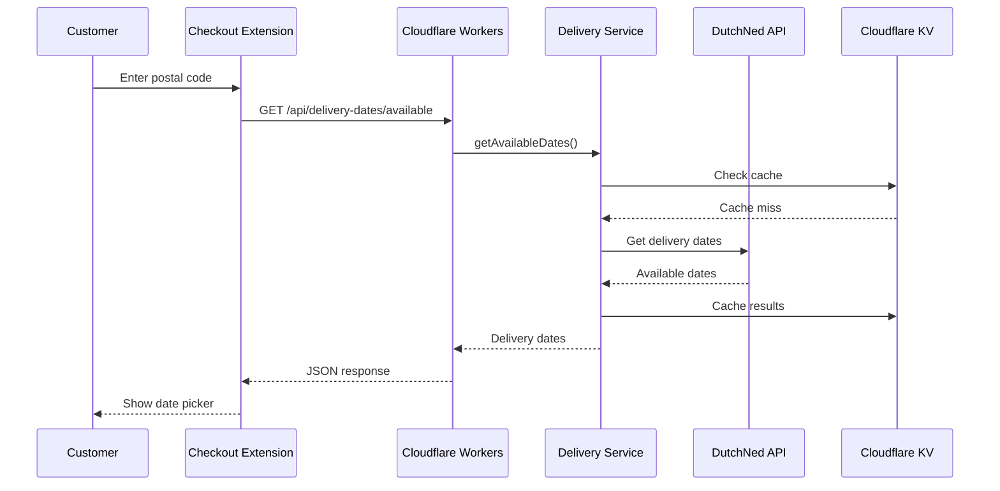

# System Components Architecture

> Detailed breakdown of all system components, their relationships, and technical specifications.

## 🏗️ Component Overview

The WOOOD Delivery Date Picker is built as a distributed system with multiple components working together to provide seamless delivery date selection and management.



## 🎯 Frontend Components

### Shopify Checkout Extension

**Location**: `extensions/date-picker/`

**Purpose**: Provides delivery date selection interface in Shopify checkout

**Technology Stack**:
- **React 18** with TypeScript
- **Shopify Checkout Extensions API**
- **Vite** for build system
- **ESLint** & **Prettier** for code quality

**Key Files**:
```typescript
// Main extension entry point
src/index.tsx

// Delivery date selection component
src/components/DeliveryDatePicker.tsx

// Error boundary for robustness
src/components/ErrorBoundary.tsx

// API client for backend communication
src/services/apiClient.ts

// Custom hook for delivery date logic
src/hooks/useDeliveryDates.ts
```

**Component Structure**:
```typescript
interface DeliveryDatePickerProps {
  postalCode: string;
  country: string;
  onDateSelect: (date: string) => void;
  disabled?: boolean;
}

export function DeliveryDatePicker({
  postalCode,
  country,
  onDateSelect,
  disabled = false
}: DeliveryDatePickerProps) {
  // Component implementation
}
```

### Frontend Admin Interface

**Location**: `frontend/`

**Purpose**: Admin dashboard for shop owners to manage delivery settings

**Technology Stack**:
- **React 18** with TypeScript
- **Shopify Polaris** for UI components
- **Vite** for development and building
- **React Router** for navigation

**Key Components**:
```typescript
// Main application wrapper
src/App.tsx

// Content area with routing
src/components/AppContent.tsx

// Loading states
src/components/LoadingPage.tsx

// Session management hook
src/hooks/useSession.ts

// Authenticated API client
src/services/authenticatedFetch.ts
```

### Date Picker UI Component

**Location**: `extensions/date-picker/src/components/`

**Purpose**: Reusable date selection interface with accessibility

**Features**:
- **Calendar View**: Visual date selection
- **Accessibility**: ARIA labels and keyboard navigation
- **Internationalization**: Dutch and English support
- **Error Handling**: Graceful degradation

**Component API**:
```typescript
interface DatePickerUIProps {
  availableDates: string[];
  selectedDate?: string;
  onDateChange: (date: string) => void;
  locale: 'en' | 'nl';
  disabled?: boolean;
  minDate?: string;
  maxDate?: string;
}
```

## ⚡ API Layer Components

### Cloudflare Workers Runtime

**Location**: `workers/src/index.ts`

**Purpose**: Main API gateway and request router

**Key Features**:
- **Edge Computing**: Global distribution via Cloudflare
- **TypeScript**: Type-safe development
- **Modular Routing**: Clean endpoint organization
- **Error Handling**: Comprehensive error management

**Request Flow**:
```typescript
export default {
  async fetch(request: Request, env: Env, ctx: ExecutionContext): Promise<Response> {
    // 1. Parse request and route
    const url = new URL(request.url);
    const path = url.pathname;

    // 2. Apply security headers
    const securityHeaders = await securityHeadersService.getHeaders(request, env);

    // 3. Route to appropriate handler
    const response = await routeRequest(request, env, ctx);

    // 4. Apply security headers to response
    return new Response(response.body, {
      status: response.status,
      headers: { ...response.headers, ...securityHeaders }
    });
  }
};
```

### Authentication Middleware

**Location**: `workers/src/middleware/authenticationMiddleware.ts`

**Purpose**: Handles all authentication and authorization logic

**Authentication Matrix**:
```typescript
const authRequirements = {
  '/health': 'none',
  '/auth/*': 'none',
  '/api/delivery-dates/*': 'session',
  '/api/shipping-methods/*': 'session',
  '/api/admin/*': 'session_admin',
  '/api/webhooks/*': 'webhook'
};
```

**Middleware Chain**:
```typescript
export async function authenticationMiddleware(
  request: Request,
  env: Env,
  authType: AuthType
): Promise<AuthResult> {
  switch (authType) {
    case 'none':
      return { success: true };
    case 'session':
      return await sessionAuthMiddleware(request, env);
    case 'session_admin':
      return await adminAuthMiddleware(request, env);
    case 'webhook':
      return await webhookAuthMiddleware(request, env);
    default:
      return { success: false, error: 'Unknown auth type' };
  }
}
```

### Validation Middleware

**Location**: `workers/src/middleware/inputValidationService.ts`

**Purpose**: Validates and sanitizes all incoming requests

**Validation Pipeline**:
```typescript
export async function validateRequest(
  request: Request,
  schema: ValidationSchema
): Promise<ValidationResult> {
  // 1. Parse request body
  const body = await parseRequestBody(request);

  // 2. Apply validation schema
  const validationResult = await applySchema(body, schema);

  // 3. Sanitize inputs
  const sanitizedData = await sanitizeInputs(validationResult.data);

  // 4. Check for security threats
  const securityCheck = await checkSecurityThreats(sanitizedData);

  return {
    success: validationResult.success && securityCheck.safe,
    data: sanitizedData,
    errors: [...validationResult.errors, ...securityCheck.threats]
  };
}
```

## 🔧 Business Layer Components

### Delivery Service

**Location**: `workers/src/services/deliveryDatesService.ts`

**Purpose**: Core business logic for delivery date calculation and management

**Key Methods**:
```typescript
class DeliveryDatesService {
  // Get available delivery dates for postal code
  async getAvailableDates(
    postalCode: string,
    country: string = 'NL',
    env: Env
  ): Promise<DeliveryDate[]>;

  // Validate selected delivery date
  async validateDeliveryDate(
    date: string,
    postalCode: string,
    env: Env
  ): Promise<ValidationResult>;

  // Reserve delivery slot
  async reserveDeliverySlot(
    orderId: string,
    date: string,
    postalCode: string,
    env: Env
  ): Promise<ReservationResult>;

  // Cancel delivery reservation
  async cancelDeliveryReservation(
    orderId: string,
    env: Env
  ): Promise<CancellationResult>;
}
```

**Integration Points**:
- **DutchNed API**: External delivery scheduling
- **Cloudflare KV**: Caching and temporary storage
- **Shopify Metafields**: Persistent order data

### Shipping Method Service

**Location**: `workers/src/services/shippingMethodService.ts`

**Purpose**: Manages shipping methods and delivery options

**Service Interface**:
```typescript
interface ShippingMethodService {
  // Get available shipping methods
  getShippingMethods(
    postalCode: string,
    orderValue: number,
    env: Env
  ): Promise<ShippingMethod[]>;

  // Calculate shipping costs
  calculateShippingCost(
    method: ShippingMethod,
    orderDetails: OrderDetails,
    env: Env
  ): Promise<ShippingCost>;

  // Filter delivery dates by shipping method
  filterDatesByShippingMethod(
    dates: DeliveryDate[],
    method: ShippingMethod
  ): DeliveryDate[];
}
```

### Metafield Service

**Location**: `workers/src/services/metafieldService.ts`

**Purpose**: Manages Shopify metafields for persistent data storage

**Metafield Schema**:
```typescript
const metafieldDefinitions = {
  delivery_date: {
    namespace: 'woood_delivery',
    key: 'selected_date',
    type: 'date',
    description: 'Customer selected delivery date'
  },
  delivery_status: {
    namespace: 'woood_delivery',
    key: 'status',
    type: 'single_line_text_field',
    description: 'Current delivery status'
  },
  postal_code: {
    namespace: 'woood_delivery',
    key: 'postal_code',
    type: 'single_line_text_field',
    description: 'Delivery postal code'
  }
};
```

### Feature Flags Service

**Location**: `workers/src/services/featureFlagsService.ts`

**Purpose**: Manages feature flags for A/B testing and gradual rollouts

**Flag Configuration**:
```typescript
interface FeatureFlag {
  name: string;
  enabled: boolean;
  description: string;
  shop_specific?: boolean;
  rollout_percentage?: number;
  conditions?: FeatureFlagConditions;
}

const defaultFlags: FeatureFlag[] = [
  {
    name: 'delivery_date_picker_enabled',
    enabled: true,
    description: 'Enable delivery date picker in checkout'
  },
  {
    name: 'express_shipping_enabled',
    enabled: false,
    description: 'Enable express shipping options',
    rollout_percentage: 50
  }
];
```

## 💾 Storage Layer Components

### Cloudflare KV Storage

**Location**: Multiple service files

**Purpose**: High-performance edge storage for caching and sessions

**Storage Patterns**:
```typescript
// Session storage with encryption
const sessionKey = `session:${sessionId}`;
await env.WOOOD_KV.put(sessionKey, encryptedSession, { expirationTtl: 86400 });

// Feature flags cache
const flagsKey = `feature_flags:${shop}`;
await env.WOOOD_KV.put(flagsKey, JSON.stringify(flags), { expirationTtl: 3600 });

// Delivery date cache
const deliveryKey = `delivery_dates:${postalCode}:${date}`;
await env.WOOOD_KV.put(deliveryKey, JSON.stringify(dates), { expirationTtl: 1800 });
```

### Shopify Metafields Integration

**Location**: `workers/src/services/metafieldService.ts`

**Purpose**: Persistent storage in Shopify for order-related data

**Metafield Operations**:
```typescript
// Create order metafield
async createOrderMetafield(
  orderId: string,
  namespace: string,
  key: string,
  value: string,
  type: string,
  env: Env
): Promise<Metafield>;

// Update existing metafield
async updateOrderMetafield(
  metafieldId: string,
  value: string,
  env: Env
): Promise<Metafield>;

// Batch metafield operations
async batchUpdateMetafields(
  operations: MetafieldOperation[],
  env: Env
): Promise<BatchResult>;
```

### Session Cache Management

**Location**: `workers/src/utils/sessionStorage.ts`

**Purpose**: Encrypted session storage with security features

**Security Features**:
```typescript
class SessionStorage {
  // Encrypt session data
  private async encryptSession(session: Session, env: Env): Promise<string>;

  // Decrypt session data
  private async decryptSession(encrypted: string, env: Env): Promise<Session>;

  // Validate session fingerprint
  private async validateFingerprint(session: Session, request: Request): Promise<boolean>;

  // Clean up expired sessions
  async cleanupExpiredSessions(env: Env): Promise<number>;
}
```

## 🌐 External Service Components

### DutchNed API Integration

**Location**: `workers/src/api/dutchNedClient.ts`

**Purpose**: Integration with DutchNed logistics platform

**API Client Structure**:
```typescript
class DutchNedClient {
  private baseUrl = 'https://eekhoorn-connector.dutchned.com';

  // Get available delivery dates
  async getDeliveryDates(
    postalCode: string,
    startDate: string,
    endDate: string
  ): Promise<DutchNedDeliveryDate[]>;

  // Create delivery booking
  async createDeliveryBooking(
    orderDetails: OrderDetails,
    deliveryDate: string
  ): Promise<BookingResult>;

  // Update existing booking
  async updateDeliveryBooking(
    bookingId: string,
    updates: BookingUpdates
  ): Promise<BookingResult>;
}
```

### Shopify Admin API Integration

**Location**: Multiple service files

**Purpose**: Integration with Shopify for order and metafield management

**GraphQL Operations**:
```graphql
# Create order metafield
mutation orderMetafieldCreate($input: OrderMetafieldCreateInput!) {
  orderMetafieldCreate(input: $input) {
    metafield {
      id
      namespace
      key
      value
    }
    userErrors {
      field
      message
    }
  }
}

# Get order details
query getOrder($id: ID!) {
  order(id: $id) {
    id
    name
    email
    shippingAddress {
      address1
      city
      province
      zip
      country
    }
    metafields(first: 10) {
      edges {
        node {
          namespace
          key
          value
        }
      }
    }
  }
}
```

### Shopify Webhooks Handler

**Location**: `workers/src/handlers/webhooks.ts`

**Purpose**: Processes incoming Shopify webhook events

**Webhook Processing Pipeline**:
```typescript
export async function handleWebhook(
  topic: string,
  payload: any,
  request: Request,
  env: Env
): Promise<Response> {
  // 1. Validate HMAC signature
  const isValid = await validateWebhookSignature(request, env);
  if (!isValid) {
    return new Response('Unauthorized', { status: 401 });
  }

  // 2. Route to specific handler
  switch (topic) {
    case 'orders/paid':
      return await handleOrderPaid(payload, env);
    case 'orders/updated':
      return await handleOrderUpdated(payload, env);
    case 'orders/cancelled':
      return await handleOrderCancelled(payload, env);
    case 'app/uninstalled':
      return await handleAppUninstalled(payload, env);
    default:
      return new Response('Unknown topic', { status: 400 });
  }
}
```

## 🔗 Component Interactions

### Request Flow Example



### Error Propagation

```typescript
// Error handling across components
try {
  // Delivery service call
  const dates = await deliveryService.getAvailableDates(postalCode, country, env);
  return { success: true, data: dates };
} catch (error) {
  // Log error with context
  await logger.error('delivery_dates_error', {
    postal_code: postalCode,
    error: error.message,
    stack: error.stack
  });

  // Return appropriate error response
  if (error instanceof ValidationError) {
    return { success: false, error: 'VALIDATION_FAILED', details: error.details };
  } else if (error instanceof ExternalServiceError) {
    return { success: false, error: 'EXTERNAL_SERVICE_ERROR', retry: true };
  } else {
    return { success: false, error: 'SYSTEM_ERROR' };
  }
}
```

## 📊 Performance Characteristics

### Component Response Times

| Component | Typical Response Time | SLA |
|-----------|----------------------|-----|
| Cloudflare Workers | 10-50ms | <100ms |
| Delivery Service | 50-200ms | <500ms |
| DutchNed API | 200-800ms | <2s |
| Shopify Admin API | 100-500ms | <1s |
| KV Storage | 5-20ms | <50ms |

### Scalability Limits

| Component | Requests/Second | Storage Limit |
|-----------|-----------------|---------------|
| Cloudflare Workers | 10,000/second | N/A |
| KV Storage | 1,000/second | 25MB per key |
| Session Storage | 500/second | 1MB per session |
| Metafield Service | 100/second | 10KB per field |

## 🔧 Development Guidelines

### Component Testing

```typescript
// Unit test example for delivery service
describe('DeliveryService', () => {
  it('should return available dates for valid postal code', async () => {
    const service = new DeliveryService();
    const dates = await service.getAvailableDates('1234AB', 'NL', mockEnv);

    expect(dates).toHaveLength(5);
    expect(dates[0].date).toMatch(/^\d{4}-\d{2}-\d{2}$/);
  });
});

// Integration test example
describe('API Integration', () => {
  it('should handle complete delivery date flow', async () => {
    // Test full request flow
    const response = await request(app)
      .post('/api/delivery-dates/available')
      .send({ postal_code: '1234AB', country: 'NL' })
      .expect(200);

    expect(response.body.dates).toBeDefined();
  });
});
```

### Component Monitoring

```typescript
// Performance monitoring
export async function monitorComponent(
  componentName: string,
  operation: () => Promise<any>,
  env: Env
): Promise<any> {
  const startTime = Date.now();

  try {
    const result = await operation();
    const duration = Date.now() - startTime;

    // Log performance metrics
    await logMetrics(componentName, 'success', duration, env);

    return result;
  } catch (error) {
    const duration = Date.now() - startTime;

    // Log error metrics
    await logMetrics(componentName, 'error', duration, env);

    throw error;
  }
}
```

---

**🏗️ Architecture Note**: This component structure enables horizontal scaling, independent deployments, and clear separation of concerns while maintaining high performance and reliability.
