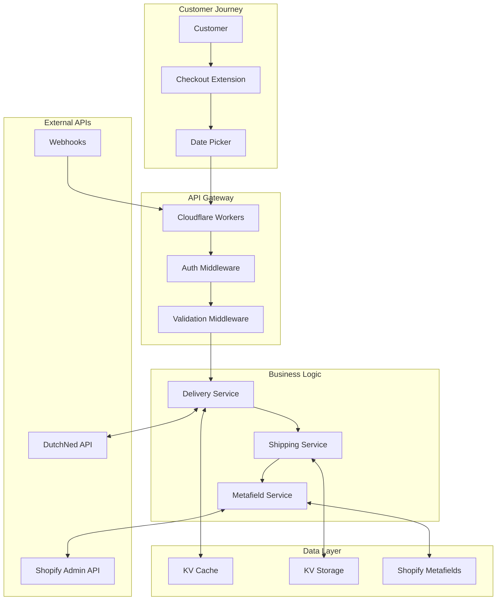
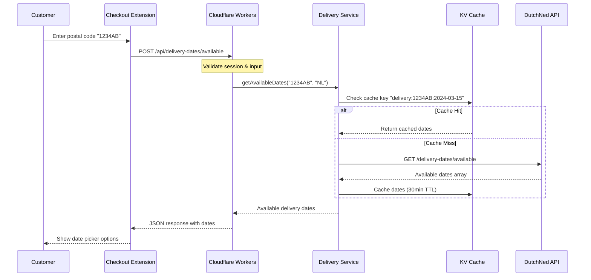
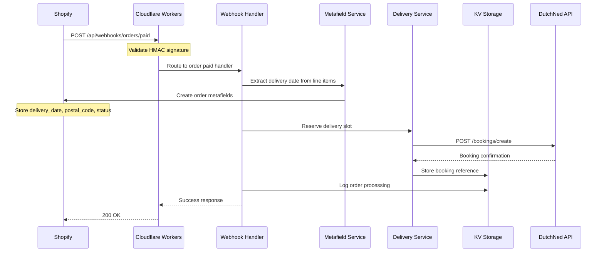
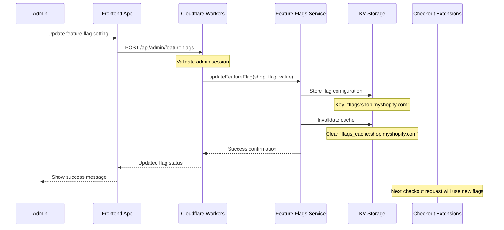
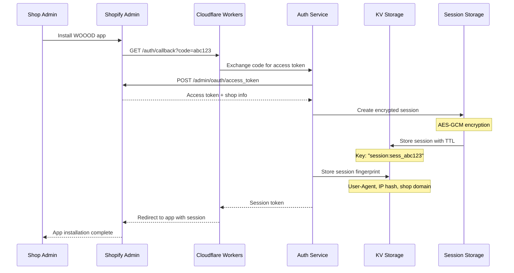
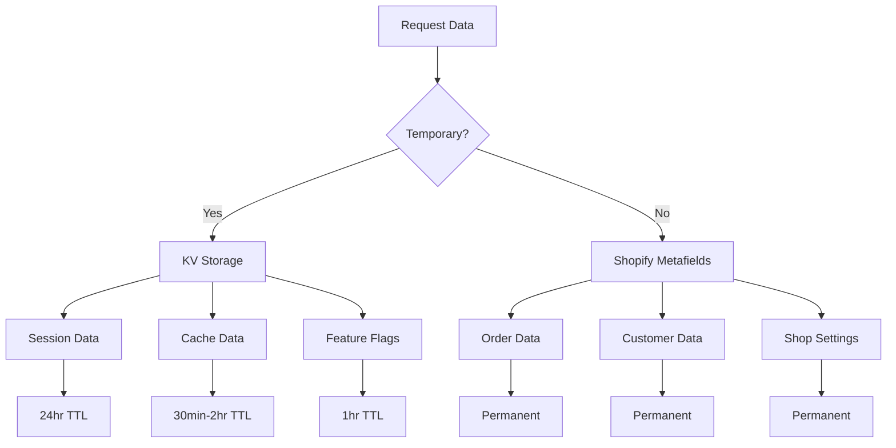

# Data Flow Architecture

> Complete data flow documentation showing how information moves through the WOOOD Delivery Date Picker system.

## 🌊 Data Flow Overview

The WOOOD Delivery Date Picker manages multiple data flows including customer interactions, order processing, delivery scheduling, and administrative operations. Data flows are designed for performance, reliability, and consistency.



## 🔄 Primary Data Flows

### 1. Delivery Date Selection Flow

**Trigger**: Customer enters postal code in checkout



**Data Transformation**:
```typescript
// Input from customer
interface CustomerInput {
  postalCode: string;  // "1234AB"
  country?: string;    // "NL" (default)
}

// External API response from DutchNed
interface DutchNedResponse {
  delivery_dates: Array<{
    date: string;           // "2024-03-20"
    time_slots: Array<{
      start: string;        // "09:00"
      end: string;          // "17:00"
      available: boolean;
    }>;
    capacity: number;       // 5
    price_modifier: number; // 0.0
  }>;
}

// Transformed response to frontend
interface DeliveryDatesResponse {
  dates: Array<{
    date: string;          // "2024-03-20"
    displayName: string;   // "Wednesday, March 20"
    available: boolean;    // true
    timeSlots: Array<{
      label: string;       // "Morning (9:00-12:00)"
      value: string;       // "morning"
      available: boolean;
    }>;
    metadata: {
      capacity: number;
      priceModifier: number;
    };
  }>;
  postalCode: string;
  validUntil: string;      // Cache expiry
}
```

### 2. Order Processing Flow

**Trigger**: Customer completes order with selected delivery date



**Data Persistence Pattern**:
```typescript
// Order webhook payload processing
async function processOrderPaid(order: ShopifyOrder) {
  // 1. Extract delivery data from line item properties
  const deliveryDate = extractDeliveryDate(order.line_items);
  const postalCode = order.shipping_address.zip;

  // 2. Create persistent metafields in Shopify
  await createOrderMetafields(order.id, {
    'woood_delivery.selected_date': deliveryDate,
    'woood_delivery.postal_code': postalCode,
    'woood_delivery.status': 'scheduled'
  });

  // 3. Create booking with DutchNed
  const booking = await dutchNedClient.createBooking({
    orderId: order.id,
    deliveryDate,
    address: order.shipping_address
  });

  // 4. Store booking reference in KV with order correlation
  await env.WOOOD_KV.put(
    `booking:${order.id}`,
    JSON.stringify({
      bookingId: booking.id,
      deliveryDate,
      status: 'confirmed',
      createdAt: new Date().toISOString()
    }),
    { expirationTtl: 86400 * 30 } // 30 days
  );
}
```

### 3. Admin Configuration Flow

**Trigger**: Shop admin updates feature flags or settings



### 4. Session Management Flow

**Trigger**: OAuth installation or session validation



## 💾 Data Storage Patterns

### Caching Strategy

**Multi-Layer Caching**:
```typescript
class DataCacheService {
  // L1: Memory cache (in-request)
  private memoryCache = new Map<string, CacheEntry>();

  // L2: KV edge cache (global)
  private kvCache: KVNamespace;

  // L3: External API (source of truth)
  private externalApi: ExternalAPIClient;

  async getData(key: string): Promise<any> {
    // Check L1 cache first
    if (this.memoryCache.has(key)) {
      return this.memoryCache.get(key).data;
    }

    // Check L2 cache
    const cached = await this.kvCache.get(key);
    if (cached) {
      const data = JSON.parse(cached);
      this.memoryCache.set(key, { data, expires: Date.now() + 60000 });
      return data;
    }

    // Fetch from L3 (external API)
    const data = await this.externalApi.fetch(key);

    // Cache in both layers
    await this.kvCache.put(key, JSON.stringify(data), { expirationTtl: 1800 });
    this.memoryCache.set(key, { data, expires: Date.now() + 60000 });

    return data;
  }
}
```

**Cache Keys Structure**:
```typescript
const cacheKeys = {
  // Delivery dates (30min TTL)
  deliveryDates: (postalCode: string, date: string) =>
    `delivery:${postalCode}:${date}`,

  // Feature flags (1hr TTL)
  featureFlags: (shop: string) =>
    `flags:${shop}`,

  // Sessions (24hr TTL)
  session: (sessionId: string) =>
    `session:${sessionId}`,

  // Shipping methods (2hr TTL)
  shippingMethods: (postalCode: string) =>
    `shipping:${postalCode}`,

  // Order bookings (30 days TTL)
  orderBooking: (orderId: string) =>
    `booking:${orderId}`
};
```

### Data Persistence Hierarchy



**Storage Decision Matrix**:
| Data Type | Storage | TTL | Backup | Use Case |
|-----------|---------|-----|--------|----------|
| Sessions | KV | 24h | No | Authentication |
| Delivery Dates | KV | 30m | No | Performance |
| Feature Flags | KV | 1h | No | Configuration |
| Order Delivery Data | Metafields | ∞ | Yes | Business Data |
| Customer Preferences | Metafields | ∞ | Yes | Personalization |
| Booking References | KV | 30d | No | Integration |

### Data Synchronization

**Shopify → Workers Sync**:
```typescript
export async function syncOrderData(orderId: string, env: Env) {
  // 1. Fetch order from Shopify
  const order = await shopifyClient.getOrder(orderId);

  // 2. Extract delivery-related metafields
  const deliveryMetafields = order.metafields.filter(
    m => m.namespace === 'woood_delivery'
  );

  // 3. Update KV cache with latest data
  const cacheData = {
    orderId: order.id,
    deliveryDate: findMetafield(deliveryMetafields, 'selected_date'),
    status: findMetafield(deliveryMetafields, 'status'),
    lastUpdated: new Date().toISOString()
  };

  await env.WOOOD_KV.put(
    `order_cache:${orderId}`,
    JSON.stringify(cacheData),
    { expirationTtl: 3600 }
  );

  return cacheData;
}
```

**Workers → DutchNed Sync**:
```typescript
export async function syncDeliveryBooking(orderId: string, env: Env) {
  // 1. Get booking from KV
  const bookingData = await env.WOOOD_KV.get(`booking:${orderId}`);

  if (!bookingData) {
    throw new Error('Booking not found');
  }

  const booking = JSON.parse(bookingData);

  // 2. Check status with DutchNed
  const externalStatus = await dutchNedClient.getBookingStatus(booking.bookingId);

  // 3. Update local status if changed
  if (externalStatus.status !== booking.status) {
    booking.status = externalStatus.status;
    booking.lastUpdated = new Date().toISOString();

    await env.WOOOD_KV.put(
      `booking:${orderId}`,
      JSON.stringify(booking),
      { expirationTtl: 86400 * 30 }
    );

    // 4. Update Shopify metafield
    await updateOrderMetafield(orderId, 'woood_delivery.status', externalStatus.status);
  }

  return booking;
}
```

## 🔄 Data Transformation Pipelines

### Input Validation Pipeline

```typescript
interface ValidationPipeline {
  input: any;
  schema: ValidationSchema;
  sanitizers: Sanitizer[];
  validators: Validator[];
}

export async function processInput(pipeline: ValidationPipeline): Promise<any> {
  let data = pipeline.input;

  // 1. Type validation
  data = await validateTypes(data, pipeline.schema);

  // 2. Sanitization
  for (const sanitizer of pipeline.sanitizers) {
    data = await sanitizer.process(data);
  }

  // 3. Business validation
  for (const validator of pipeline.validators) {
    const result = await validator.validate(data);
    if (!result.valid) {
      throw new ValidationError(result.errors);
    }
  }

  // 4. Security check
  const securityCheck = await checkSecurityThreats(data);
  if (!securityCheck.safe) {
    throw new SecurityError(securityCheck.threats);
  }

  return data;
}
```

### Output Transformation Pipeline

```typescript
export class OutputTransformer {
  // Transform internal data for API response
  static transformForAPI(data: InternalData): APIResponse {
    return {
      ...data,
      // Remove internal fields
      internalId: undefined,
      debugInfo: undefined,

      // Format dates for frontend
      dates: data.dates.map(date => ({
        ...date,
        displayName: formatDisplayDate(date.date, data.locale)
      })),

      // Add metadata
      metadata: {
        requestId: data.requestId,
        generatedAt: new Date().toISOString(),
        cacheHit: data.fromCache
      }
    };
  }

  // Transform for external API
  static transformForDutchNed(orderData: OrderData): DutchNedBookingRequest {
    return {
      external_order_id: orderData.shopifyOrderId,
      delivery_date: orderData.selectedDate,
      delivery_address: {
        street: orderData.address.address1,
        city: orderData.address.city,
        postal_code: orderData.address.zip,
        country: orderData.address.country
      },
      contact: {
        name: `${orderData.address.firstName} ${orderData.address.lastName}`,
        email: orderData.email,
        phone: orderData.phone
      }
    };
  }
}
```

## 📊 Data Flow Monitoring

### Metrics Collection

```typescript
interface DataFlowMetrics {
  timestamp: string;
  flow: string;
  duration_ms: number;
  success: boolean;
  error_type?: string;
  data_size_bytes: number;
  cache_hit: boolean;
}

export async function trackDataFlow(
  flowName: string,
  operation: () => Promise<any>,
  env: Env
): Promise<any> {
  const startTime = Date.now();
  let success = false;
  let error_type: string | undefined;
  let data_size = 0;

  try {
    const result = await operation();
    success = true;
    data_size = JSON.stringify(result).length;
    return result;
  } catch (error) {
    error_type = error.constructor.name;
    throw error;
  } finally {
    const metrics: DataFlowMetrics = {
      timestamp: new Date().toISOString(),
      flow: flowName,
      duration_ms: Date.now() - startTime,
      success,
      error_type,
      data_size_bytes: data_size,
      cache_hit: false // Set by individual operations
    };

    // Store metrics in KV for analysis
    await env.WOOOD_KV.put(
      `metrics:${flowName}:${Date.now()}`,
      JSON.stringify(metrics),
      { expirationTtl: 86400 * 7 } // 7 days
    );
  }
}
```

### Data Quality Monitoring

```typescript
export class DataQualityMonitor {
  static async validateDataIntegrity(env: Env): Promise<QualityReport> {
    const report: QualityReport = {
      timestamp: new Date().toISOString(),
      checks: []
    };

    // Check session data consistency
    const sessionCheck = await this.checkSessionIntegrity(env);
    report.checks.push({
      name: 'session_integrity',
      passed: sessionCheck.valid,
      details: sessionCheck.details
    });

    // Check cache coherence
    const cacheCheck = await this.checkCacheCoherence(env);
    report.checks.push({
      name: 'cache_coherence',
      passed: cacheCheck.coherent,
      details: cacheCheck.details
    });

    // Check external API consistency
    const apiCheck = await this.checkAPIConsistency(env);
    report.checks.push({
      name: 'api_consistency',
      passed: apiCheck.consistent,
      details: apiCheck.details
    });

    return report;
  }

  private static async checkCacheCoherence(env: Env): Promise<any> {
    // Verify cache entries have valid TTL and structure
    const cacheKeys = await env.WOOOD_KV.list({ prefix: 'delivery:' });

    for (const key of cacheKeys.keys) {
      const value = await env.WOOOD_KV.get(key.name);
      if (value) {
        try {
          const parsed = JSON.parse(value);
          // Validate cache entry structure
          if (!parsed.dates || !Array.isArray(parsed.dates)) {
            return { coherent: false, details: `Invalid cache structure: ${key.name}` };
          }
        } catch (error) {
          return { coherent: false, details: `Invalid JSON in cache: ${key.name}` };
        }
      }
    }

    return { coherent: true, details: 'All cache entries valid' };
  }
}
```

## 🚨 Error Handling in Data Flows

### Circuit Breaker Pattern

```typescript
export class CircuitBreaker {
  private failures = 0;
  private lastFailTime = 0;
  private state: 'closed' | 'open' | 'half-open' = 'closed';

  constructor(
    private threshold: number = 5,
    private timeout: number = 60000
  ) {}

  async execute<T>(operation: () => Promise<T>): Promise<T> {
    if (this.state === 'open') {
      if (Date.now() - this.lastFailTime > this.timeout) {
        this.state = 'half-open';
      } else {
        throw new Error('Circuit breaker is open');
      }
    }

    try {
      const result = await operation();
      this.onSuccess();
      return result;
    } catch (error) {
      this.onFailure();
      throw error;
    }
  }

  private onSuccess() {
    this.failures = 0;
    this.state = 'closed';
  }

  private onFailure() {
    this.failures++;
    this.lastFailTime = Date.now();

    if (this.failures >= this.threshold) {
      this.state = 'open';
    }
  }
}
```

### Data Recovery Strategies

```typescript
export class DataRecoveryService {
  // Recover from cache corruption
  static async recoverFromCacheFailure(key: string, env: Env): Promise<any> {
    try {
      // 1. Clear corrupted cache entry
      await env.WOOOD_KV.delete(key);

      // 2. Fetch fresh data from source
      const freshData = await this.fetchFromSource(key);

      // 3. Restore cache with fresh data
      await env.WOOOD_KV.put(key, JSON.stringify(freshData), {
        expirationTtl: 1800
      });

      return freshData;
    } catch (error) {
      // Log recovery failure
      await logger.error('cache_recovery_failed', { key, error: error.message });
      throw error;
    }
  }

  // Recover from external API failure
  static async recoverFromAPIFailure(operation: string, env: Env): Promise<any> {
    // 1. Try cached fallback data
    const fallbackKey = `fallback:${operation}`;
    const fallbackData = await env.WOOOD_KV.get(fallbackKey);

    if (fallbackData) {
      return JSON.parse(fallbackData);
    }

    // 2. Return minimal safe response
    return this.getMinimalResponse(operation);
  }
}
```

---

**🌊 Data Flow Note**: This architecture ensures data consistency, performance, and reliability across all system components while maintaining clear data lineage and audit trails.
