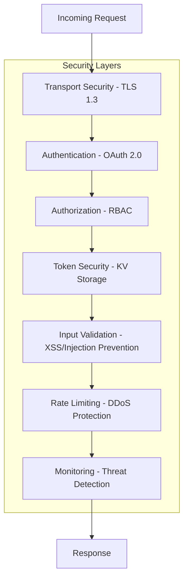
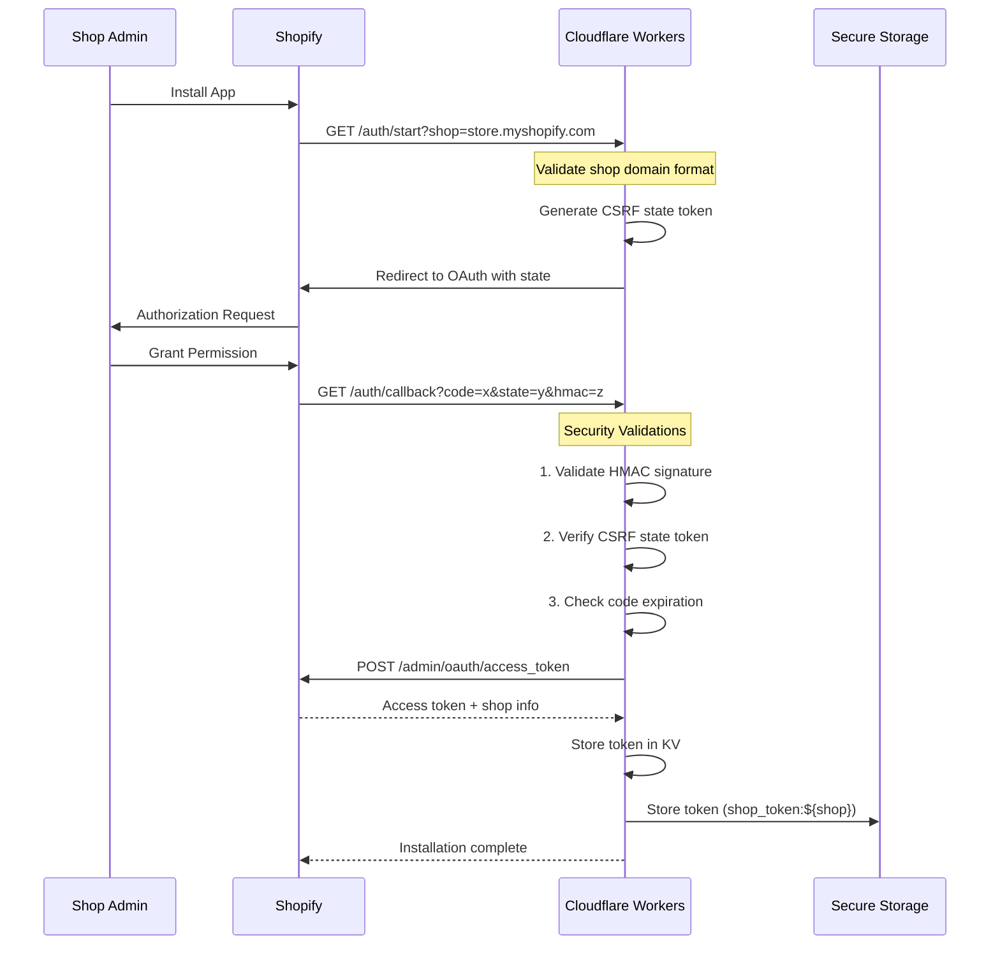

# Security Model

> Complete security architecture documentation for the WOOOD Delivery Date Picker system.

## 🔒 Security Overview

The WOOOD Delivery Date Picker implements enterprise-grade security controls designed to protect customer data, prevent unauthorized access, and ensure compliance with privacy regulations including GDPR.

### Security Principles

- **Zero Trust Architecture**: Never trust, always verify
- **Defense in Depth**: Multiple security layers
- **Principle of Least Privilege**: Minimal necessary access
- **Data Minimization**: Collect only required data
- **Encryption Everywhere**: End-to-end data protection

## 🛡️ Security Architecture

The WOOOD Delivery Date Picker implements a **7-layer security model**:



## 🛡️ Authentication & Authorization

### OAuth 2.0 Implementation

**OAuth Flow Security**:


**Security Validations**:
```typescript
export async function validateOAuthCallback(
  request: Request,
  env: Env
): Promise<OAuthValidationResult> {
  const url = new URL(request.url);
  const params = url.searchParams;

  // 1. Extract parameters
  const code = params.get('code');
  const state = params.get('state');
  const shop = params.get('shop');
  const hmac = params.get('hmac');

  // 2. Validate required parameters
  if (!code || !state || !shop || !hmac) {
    return { valid: false, error: 'Missing required OAuth parameters' };
  }

  // 3. Validate shop domain format
  if (!shop.match(/^[a-zA-Z0-9][a-zA-Z0-9-]*\.myshopify\.com$/)) {
    return { valid: false, error: 'Invalid shop domain format' };
  }

  // 4. Verify CSRF state token
  const expectedState = await getStoredState(shop, env);
  if (state !== expectedState) {
    return { valid: false, error: 'CSRF state token mismatch' };
  }

  // 5. Validate HMAC signature
  const isValidHmac = await validateShopifyHmac(params, env.SHOPIFY_APP_CLIENT_SECRET);
  if (!isValidHmac) {
    return { valid: false, error: 'HMAC signature validation failed' };
  }

  // 6. Check code expiration (Shopify codes expire in 10 minutes)
  const codeAge = Date.now() - parseInt(params.get('timestamp') || '0') * 1000;
  if (codeAge > 600000) { // 10 minutes
    return { valid: false, error: 'Authorization code expired' };
  }

  return { valid: true };
}
```

### Role-Based Access Control (RBAC)

**Authorization Matrix**:
```typescript
interface SecurityContext {
  authType: 'none' | 'token' | 'admin' | 'webhook';
  shop?: string;
  accessToken?: string;
  ipAddress: string;
  userAgent: string;
}

const authorizationMatrix = {
  // Public endpoints
  '/health': ['none'],
  '/auth/start': ['none'],
  '/auth/callback': ['none'],

  // Customer API endpoints
  '/api/delivery-dates/available': ['token', 'admin'],
  '/api/shipping-methods/available': ['token', 'admin'],

  // Admin endpoints
  '/api/admin/feature-flags': ['admin'],
  '/api/admin/system-health': ['admin'],
  '/api/admin/activity-log': ['admin'],

  // Webhook endpoints
  '/api/webhooks/*': ['webhook'],

  // Internal endpoints
  '/internal/*': [] // No external access
};

export async function authorize(
  endpoint: string,
  context: SecurityContext,
  env: Env
): Promise<AuthorizationResult> {
  const requiredRoles = getRequiredRoles(endpoint);

  if (requiredRoles.length === 0) {
    return { authorized: false, error: 'Endpoint not accessible' };
  }

  if (requiredRoles.includes('none')) {
    return { authorized: true };
  }

  // Check if context has required role
  if (!requiredRoles.includes(context.authType)) {
    return { authorized: false, error: 'Insufficient permissions' };
  }

  // Additional checks for admin endpoints
  if (context.authType === 'admin') {
    return await validateAdminAccess(context, env);
  }

  return { authorized: true };
}
```

### Token Security

**SimpleTokenService Implementation**:
```typescript
export class SimpleTokenService {
  constructor(private env: Env) {}

  async storeToken(shop: string, accessToken: string): Promise<void> {
    const tokenData: ShopToken = {
      accessToken,
      createdAt: new Date().toISOString(),
      shop
    };

    await this.env.DELIVERY_CACHE.put(
      `shop_token:${shop}`,
      JSON.stringify(tokenData),
      { expirationTtl: 86400 * 365 * 2 } // 2 years
    );
  }

  async getToken(shop: string): Promise<string | null> {
    try {
      const tokenData = await this.env.DELIVERY_CACHE.get(`shop_token:${shop}`);
      if (!tokenData) {
        return null;
      }

      const parsed: ShopToken = JSON.parse(tokenData);
      return parsed.accessToken || null;
    } catch (error) {
      console.error('Failed to get token for shop:', shop, error);
      return null;
    }
  }

  async deleteToken(shop: string): Promise<void> {
    await this.env.DELIVERY_CACHE.delete(`shop_token:${shop}`);
  }
}
```

**Token Security Features**:
- **Shop Isolation**: Each shop has its own token key (`shop_token:${shop}`)
- **Automatic Expiration**: Tokens expire after 2 years
- **No Encryption Overhead**: Tokens stored as-is (Shopify tokens are already secure)
- **Simple Lookup**: Direct KV lookup by shop domain
- **No Session State**: Eliminates session corruption and race conditions

## 🔐 Data Protection

### Encryption Standards

**Data Classification**:
```typescript
enum DataClassification {
  PUBLIC = 'public',           // No encryption required
  INTERNAL = 'internal',       // Transport encryption
  CONFIDENTIAL = 'confidential', // AES-256 encryption
  RESTRICTED = 'restricted'    // AES-256 + key rotation
}

const dataClassificationMap = {
  // Public data
  'delivery_dates': DataClassification.PUBLIC,
  'shipping_methods': DataClassification.PUBLIC,
  'feature_flags': DataClassification.INTERNAL,

  // Confidential data
  'session_tokens': DataClassification.CONFIDENTIAL,
  'api_keys': DataClassification.RESTRICTED,
  'webhook_secrets': DataClassification.RESTRICTED,

  // Personal data (GDPR)
  'customer_addresses': DataClassification.CONFIDENTIAL,
  'order_details': DataClassification.CONFIDENTIAL
};
```

**Field-Level Encryption**:
```typescript
export class FieldEncryption {
  static async encryptSensitiveFields(
    data: any,
    fieldMap: Record<string, DataClassification>,
    env: Env
  ): Promise<any> {
    const result = { ...data };

    for (const [field, classification] of Object.entries(fieldMap)) {
      if (classification >= DataClassification.CONFIDENTIAL && result[field]) {
        result[field] = await this.encryptField(result[field], env);
      }
    }

    return result;
  }

  private static async encryptField(value: string, env: Env): Promise<string> {
    const key = await crypto.subtle.importKey(
      'raw',
      new TextEncoder().encode(env.API_ENCRYPTION_KEY),
      { name: 'AES-GCM' },
      false,
      ['encrypt']
    );

    const iv = crypto.getRandomValues(new Uint8Array(12));
    const encryptedData = await crypto.subtle.encrypt(
      { name: 'AES-GCM', iv },
      key,
      new TextEncoder().encode(value)
    );

    // Combine IV and encrypted data
    const combined = new Uint8Array(iv.length + encryptedData.byteLength);
    combined.set(iv);
    combined.set(new Uint8Array(encryptedData), iv.length);

    return btoa(String.fromCharCode(...combined));
  }
}
```

### Secrets Management

**Secret Rotation Strategy**:
```typescript
export class SecretRotationService {
  private static readonly ROTATION_SCHEDULE = {
    API_ENCRYPTION_KEY: 90 * 24 * 60 * 60 * 1000, // 90 days
    SESSION_SECRET: 30 * 24 * 60 * 60 * 1000,     // 30 days
    WEBHOOK_SECRET: 365 * 24 * 60 * 60 * 1000     // 365 days
  };

  static async checkRotationNeeded(env: Env): Promise<RotationReport> {
    const report: RotationReport = {
      secrets: [],
      actions: []
    };

    for (const [secretName, maxAge] of Object.entries(this.ROTATION_SCHEDULE)) {
      const lastRotation = await this.getLastRotation(secretName, env);
      const age = Date.now() - lastRotation;

      if (age > maxAge) {
        report.secrets.push({
          name: secretName,
          age: age,
          status: 'rotation_required'
        });
        report.actions.push(`Rotate ${secretName}`);
      } else if (age > maxAge * 0.8) {
        report.secrets.push({
          name: secretName,
          age: age,
          status: 'rotation_warning'
        });
        report.actions.push(`Schedule ${secretName} rotation`);
      }
    }

    return report;
  }

  static async rotateSecret(secretName: string, env: Env): Promise<void> {
    // 1. Generate new secret
    const newSecret = await this.generateSecureSecret(32);

    // 2. Store with versioning
    await env.WOOOD_KV.put(
      `secret:${secretName}:new`,
      newSecret,
      { expirationTtl: 86400 } // 24h overlap
    );

    // 3. Update Cloudflare Workers secret
    await this.updateWorkersSecret(secretName, newSecret);

    // 4. Mark rotation timestamp
    await env.WOOOD_KV.put(
      `secret_rotation:${secretName}`,
      Date.now().toString()
    );

    // 5. Schedule old secret cleanup
    setTimeout(async () => {
      await env.WOOOD_KV.delete(`secret:${secretName}:old`);
    }, 86400000); // 24 hours
  }

  private static async generateSecureSecret(length: number): Promise<string> {
    const bytes = crypto.getRandomValues(new Uint8Array(length));
    return btoa(String.fromCharCode(...bytes))
      .replace(/[+/]/g, char => char === '+' ? '-' : '_')
      .replace(/=/g, '');
  }
}
```

## 🚨 Threat Detection & Prevention

### Input Validation & Sanitization

**XSS Prevention**:
```typescript
export class XSSProtection {
  private static readonly DANGEROUS_PATTERNS = [
    /<script[^>]*>.*?<\/script>/gi,
    /javascript:/gi,
    /on\w+\s*=/gi,
    /<iframe[^>]*>.*?<\/iframe>/gi,
    /<object[^>]*>.*?<\/object>/gi,
    /<embed[^>]*>/gi,
    /<link[^>]*>/gi,
    /<meta[^>]*>/gi
  ];

  static sanitizeInput(input: string): string {
    if (typeof input !== 'string') {
      return '';
    }

    let sanitized = input;

    // Remove dangerous patterns
    for (const pattern of this.DANGEROUS_PATTERNS) {
      sanitized = sanitized.replace(pattern, '');
    }

    // Escape HTML entities
    sanitized = sanitized
      .replace(/&/g, '&amp;')
      .replace(/</g, '&lt;')
      .replace(/>/g, '&gt;')
      .replace(/"/g, '&quot;')
      .replace(/'/g, '&#x27;')
      .replace(/\//g, '&#x2F;');

    return sanitized;
  }

  static detectXSSAttempt(input: string): boolean {
    return this.DANGEROUS_PATTERNS.some(pattern => pattern.test(input));
  }
}
```

**SQL Injection Prevention**:
```typescript
export class SQLInjectionProtection {
  private static readonly SQL_PATTERNS = [
    /(\bunion\b|\bselect\b|\binsert\b|\bdelete\b|\bupdate\b|\bdrop\b)/gi,
    /('|(\\')|(;|\\;)|(--)|(\#)|(\||(\|\|)))/gi,
    /(\bexec\b|\bexecute\b|\bsp_\w+)/gi
  ];

  static detectSQLInjection(input: string): boolean {
    return this.SQL_PATTERNS.some(pattern => pattern.test(input));
  }

  static sanitizeSQLInput(input: string): string {
    // For GraphQL/API, we escape rather than allow SQL
    return input.replace(/['";\\]/g, '\\$&');
  }
}
```

### Rate Limiting & DDoS Protection

**Adaptive Rate Limiting**:
```typescript
export class RateLimitingService {
  private static readonly DEFAULT_LIMITS = {
    '/api/delivery-dates/available': { requests: 100, window: 3600 }, // 1 hour
    '/api/admin/*': { requests: 1000, window: 3600 },
    '/api/webhooks/*': { requests: 10000, window: 3600 },
    'default': { requests: 50, window: 3600 }
  };

  static async checkRateLimit(
    request: Request,
    env: Env
  ): Promise<RateLimitResult> {
    const clientId = await this.getClientIdentifier(request);
    const endpoint = this.getEndpointPattern(request.url);
    const limits = this.DEFAULT_LIMITS[endpoint] || this.DEFAULT_LIMITS.default;

    const key = `rate_limit:${clientId}:${endpoint}`;
    const current = await env.WOOOD_KV.get(key);

    if (!current) {
      // First request in window
      await env.WOOOD_KV.put(
        key,
        JSON.stringify({ count: 1, resetTime: Date.now() + limits.window * 1000 }),
        { expirationTtl: limits.window }
      );

      return {
        allowed: true,
        remaining: limits.requests - 1,
        resetTime: Date.now() + limits.window * 1000
      };
    }

    const data = JSON.parse(current);

    if (data.count >= limits.requests) {
      // Rate limit exceeded
      await this.logRateLimitViolation(clientId, endpoint, data.count, env);

      return {
        allowed: false,
        remaining: 0,
        resetTime: data.resetTime,
        error: 'Rate limit exceeded'
      };
    }

    // Increment counter
    data.count++;
    await env.WOOOD_KV.put(key, JSON.stringify(data), { expirationTtl: limits.window });

    return {
      allowed: true,
      remaining: limits.requests - data.count,
      resetTime: data.resetTime
    };
  }

  private static async getClientIdentifier(request: Request): Promise<string> {
    // Use multiple factors for identification
    const ip = request.headers.get('CF-Connecting-IP') ||
               request.headers.get('X-Forwarded-For') || 'unknown';
    const userAgent = request.headers.get('User-Agent') || '';
    const sessionId = request.headers.get('Authorization')?.split(' ')[1] || '';

    // Create composite identifier
    const composite = `${ip}:${await sha256(userAgent)}:${await sha256(sessionId)}`;
    return await sha256(composite);
  }
}
```

### Security Monitoring

**Threat Detection Engine**:
```typescript
export class ThreatDetectionEngine {
  private static readonly THREAT_INDICATORS = {
    // Authentication threats
    multiple_failed_logins: { threshold: 5, window: 300 },
    session_hijacking: { threshold: 3, window: 600 },

    // Injection attacks
    xss_attempts: { threshold: 1, window: 60 },
    sql_injection_attempts: { threshold: 1, window: 60 },

    // Rate limiting violations
    rate_limit_violations: { threshold: 10, window: 3600 },

    // Suspicious patterns
    unusual_user_agent: { threshold: 1, window: 300 },
    tor_exit_node: { threshold: 1, window: 60 }
  };

  static async analyzeThreat(
    event: SecurityEvent,
    env: Env
  ): Promise<ThreatAnalysis> {
    const analysis: ThreatAnalysis = {
      threatLevel: 'low',
      indicators: [],
      actions: []
    };

    // Check for known threat patterns
    for (const [indicator, config] of Object.entries(this.THREAT_INDICATORS)) {
      const count = await this.getIndicatorCount(indicator, event.clientId, env);

      if (count >= config.threshold) {
        analysis.indicators.push({
          type: indicator,
          count: count,
          threshold: config.threshold,
          severity: this.getIndicatorSeverity(indicator)
        });
      }
    }

    // Calculate overall threat level
    analysis.threatLevel = this.calculateThreatLevel(analysis.indicators);

    // Determine actions
    analysis.actions = this.determineActions(analysis.threatLevel, analysis.indicators);

    return analysis;
  }

  private static calculateThreatLevel(indicators: ThreatIndicator[]): ThreatLevel {
    if (indicators.length === 0) return 'low';

    const highSeverityCount = indicators.filter(i => i.severity === 'high').length;
    const mediumSeverityCount = indicators.filter(i => i.severity === 'medium').length;

    if (highSeverityCount >= 2) return 'critical';
    if (highSeverityCount >= 1 || mediumSeverityCount >= 3) return 'high';
    if (mediumSeverityCount >= 1) return 'medium';

    return 'low';
  }

  private static determineActions(
    threatLevel: ThreatLevel,
    indicators: ThreatIndicator[]
  ): SecurityAction[] {
    const actions: SecurityAction[] = [];

    switch (threatLevel) {
      case 'critical':
        actions.push('block_ip', 'invalidate_sessions', 'alert_admin');
        break;
      case 'high':
        actions.push('increase_rate_limit', 'require_2fa', 'alert_security');
        break;
      case 'medium':
        actions.push('log_detailed', 'monitor_closely');
        break;
      case 'low':
        actions.push('log_event');
        break;
    }

    return actions;
  }
}
```

## 🔍 Security Monitoring & Logging

### Security Event Logging

```typescript
interface SecurityEvent {
  id: string;
  timestamp: string;
  type: SecurityEventType;
  severity: 'low' | 'medium' | 'high' | 'critical';
  clientId: string;
  ipAddress: string;
  userAgent: string;
  endpoint: string;
  details: Record<string, any>;
  actions: SecurityAction[];
}

export async function logSecurityEvent(
  type: SecurityEventType,
  details: Record<string, any>,
  request?: Request,
  env?: Env
): Promise<void> {
  const event: SecurityEvent = {
    id: crypto.randomUUID(),
    timestamp: new Date().toISOString(),
    type,
    severity: getEventSeverity(type),
    clientId: await getClientId(request),
    ipAddress: request?.headers.get('CF-Connecting-IP') || 'unknown',
    userAgent: request?.headers.get('User-Agent') || 'unknown',
    endpoint: request ? new URL(request.url).pathname : 'unknown',
    details,
    actions: []
  };

  // Store in KV for analysis
  if (env) {
    await env.WOOOD_KV.put(
      `security_event:${event.id}`,
      JSON.stringify(event),
      { expirationTtl: 86400 * 30 } // 30 days retention
    );

    // Real-time threat analysis
    const threatAnalysis = await ThreatDetectionEngine.analyzeThreat(event, env);

    if (threatAnalysis.threatLevel === 'critical') {
      await executeSecurityActions(threatAnalysis.actions, event, env);
    }
  }

  // Console logging for development
  console.log(`[SECURITY] ${type}:`, event);
}
```

### Compliance & Auditing

**GDPR Compliance**:
```typescript
export class GDPRComplianceService {
  static async handleDataSubjectRequest(
    requestType: 'access' | 'deletion' | 'portability',
    customerEmail: string,
    env: Env
  ): Promise<GDPRResponse> {
    switch (requestType) {
      case 'access':
        return await this.provideDataAccess(customerEmail, env);
      case 'deletion':
        return await this.deleteCustomerData(customerEmail, env);
      case 'portability':
        return await this.exportCustomerData(customerEmail, env);
      default:
        throw new Error('Invalid GDPR request type');
    }
  }

  private static async deleteCustomerData(
    customerEmail: string,
    env: Env
  ): Promise<GDPRResponse> {
    const deletedItems: string[] = [];

    // 1. Find all customer sessions
    const sessions = await this.findCustomerSessions(customerEmail, env);
    for (const sessionId of sessions) {
      await env.WOOOD_KV.delete(`session:${sessionId}`);
      deletedItems.push(`session:${sessionId}`);
    }

    // 2. Remove cached delivery preferences
    const deliveryKeys = await env.WOOOD_KV.list({
      prefix: `customer_preferences:${await sha256(customerEmail)}`
    });
    for (const key of deliveryKeys.keys) {
      await env.WOOOD_KV.delete(key.name);
      deletedItems.push(key.name);
    }

    // 3. Note: Order data in Shopify is handled by Shopify's GDPR compliance

    return {
      success: true,
      deletedItems,
      timestamp: new Date().toISOString(),
      note: 'Order data handled by Shopify GDPR compliance'
    };
  }
}
```

**Security Audit Trail**:
```typescript
export class SecurityAuditService {
  static async generateSecurityReport(
    startDate: string,
    endDate: string,
    env: Env
  ): Promise<SecurityAuditReport> {
    const report: SecurityAuditReport = {
      period: { start: startDate, end: endDate },
      summary: {
        totalEvents: 0,
        byType: {},
        bySeverity: {},
        topThreats: []
      },
      recommendations: []
    };

    // Analyze security events
    const events = await this.getSecurityEvents(startDate, endDate, env);
    report.summary.totalEvents = events.length;

    // Group by type and severity
    events.forEach(event => {
      report.summary.byType[event.type] = (report.summary.byType[event.type] || 0) + 1;
      report.summary.bySeverity[event.severity] = (report.summary.bySeverity[event.severity] || 0) + 1;
    });

    // Generate recommendations
    report.recommendations = this.generateSecurityRecommendations(events);

    return report;
  }

  private static generateSecurityRecommendations(
    events: SecurityEvent[]
  ): SecurityRecommendation[] {
    const recommendations: SecurityRecommendation[] = [];

    // Check for high frequency of failed logins
    const failedLogins = events.filter(e => e.type === 'authentication_failed').length;
    if (failedLogins > 100) {
      recommendations.push({
        type: 'authentication',
        priority: 'high',
        description: 'Consider implementing account lockout policies',
        impact: 'Reduce brute force attack success rate'
      });
    }

    // Check for XSS attempts
    const xssAttempts = events.filter(e => e.type === 'xss_attempt').length;
    if (xssAttempts > 0) {
      recommendations.push({
        type: 'input_validation',
        priority: 'high',
        description: 'Review and strengthen input validation',
        impact: 'Prevent XSS vulnerabilities'
      });
    }

    return recommendations;
  }
}
```

---

**🔒 Security Note**: This security model implements defense-in-depth principles with continuous monitoring and adaptive responses to protect against evolving threats while maintaining compliance with privacy regulations.
