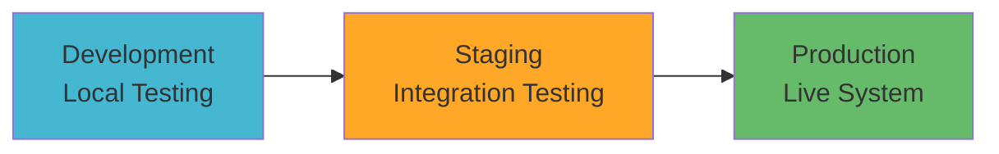

# Environment Setup Guide

> Complete guide for setting up development, staging, and production environments for the WOOOD Delivery Date Picker.

## 🏗️ Environment Overview

The WOOOD Delivery Date Picker supports multiple environment configurations to ensure smooth development workflow and reliable production deployment.

### Environment Types



| Environment | Purpose | Domain | Database | Monitoring |
|-------------|---------|---------|----------|------------|
| Development | Local development & testing | `localhost:8787` | Mock KV | Console logs |
| Staging | Integration testing & QA | `staging.woood-delivery.com` | Staging KV | Basic monitoring |
| Production | Live customer-facing system | `delivery.woood.com` | Production KV | Full monitoring |

## 🔧 Development Environment

### Prerequisites

```bash
# Required software versions
node --version    # v18.0.0 or higher
npm --version     # v8.0.0 or higher
git --version     # v2.30.0 or higher
```

### Local Setup

**1. Clone and Install Dependencies**:
```bash
# Clone repository
git clone https://github.com/woood/delivery-date-picker.git
cd delivery-date-picker

# Install dependencies
npm install

# Install Wrangler CLI
npm install -g wrangler

# Authenticate with Cloudflare
wrangler auth login
```

**2. Environment Configuration**:
```bash
# Create local environment file
cp workers/.dev.vars.example workers/.dev.vars

# Edit development variables
cat > workers/.dev.vars << EOF
SHOPIFY_APP_CLIENT_ID=your_dev_client_id
SHOPIFY_APP_CLIENT_SECRET=your_dev_client_secret
DUTCHNED_API_CREDENTIALS=your_dev_credentials
WEBHOOK_SECRET=dev_webhook_secret_64_chars_min
EOF
```

**3. KV Namespace Setup**:
```bash
# Create development KV namespace
wrangler kv:namespace create "WOOOD_KV" --preview

# Update wrangler.toml with the namespace ID
echo "[[kv_namespaces]]
binding = \"WOOOD_KV\"
id = \"your_namespace_id\"
preview_id = \"your_preview_namespace_id\"" >> workers/wrangler.toml
```

**4. Start Development Server**:
```bash
cd workers
npm run dev

# Server will be available at http://localhost:8787
```

### Development Tools

**VSCode Configuration**:
```json
// .vscode/settings.json
{
  "typescript.preferences.includePackageJsonAutoImports": "on",
  "editor.formatOnSave": true,
  "editor.codeActionsOnSave": {
    "source.fixAll.eslint": true
  },
  "files.associations": {
    "*.toml": "toml"
  }
}
```

**Debugging Setup**:
```json
// .vscode/launch.json
{
  "version": "0.2.0",
  "configurations": [
    {
      "name": "Debug Wrangler",
      "type": "node",
      "request": "launch",
      "program": "${workspaceFolder}/node_modules/.bin/wrangler",
      "args": ["dev", "--local"],
      "cwd": "${workspaceFolder}/workers",
      "console": "integratedTerminal"
    }
  ]
}
```

### Development Workflow

**Daily Development Process**:
```bash
# 1. Pull latest changes
git pull origin develop

# 2. Install new dependencies (if any)
npm install

# 3. Start development server
npm run dev

# 4. Run tests in watch mode (separate terminal)
npm run test:watch

# 5. Make changes and commit
git add .
git commit -m "feat: add new feature"
git push origin feature/your-feature-name
```

**Testing in Development**:
```bash
# Run all tests
npm test

# Run specific test suites
npm run test:unit
npm run test:integration

# Run tests with coverage
npm run test:coverage

# Run linting
npm run lint
npm run lint:fix
```

## 🔄 Staging Environment

### Purpose & Configuration

Staging environment mirrors production configuration and is used for:
- Integration testing
- QA verification
- Performance testing
- Client demonstrations

### Setup Process

**1. Cloudflare Workers Configuration**:
```bash
# Create staging environment
wrangler publish --env staging

# Configure staging secrets
wrangler secret put SHOPIFY_APP_CLIENT_SECRET --env staging
wrangler secret put DUTCHNED_API_CREDENTIALS --env staging
wrangler secret put WEBHOOK_SECRET --env staging
```

**2. Staging wrangler.toml**:
```toml
[env.staging]
name = "woood-delivery-picker-staging"
compatibility_date = "2023-12-01"

[[env.staging.kv_namespaces]]
binding = "WOOOD_KV"
id = "staging_kv_namespace_id"

[env.staging.vars]
ENVIRONMENT = "staging"
LOG_LEVEL = "debug"
CACHE_TTL_SECONDS = "300"  # 5 minutes for testing
```

**3. Domain Configuration**:
```bash
# Add custom domain for staging
wrangler publish --env staging
# Then configure staging.woood-delivery.com in Cloudflare dashboard
```

### Staging Testing

**Automated Testing Pipeline**:
```yaml
# .github/workflows/staging-deploy.yml
name: Deploy to Staging
on:
  push:
    branches: [ develop ]

jobs:
  deploy-staging:
    runs-on: ubuntu-latest
    steps:
      - uses: actions/checkout@v3
      - uses: actions/setup-node@v3
        with:
          node-version: '18'

      - name: Install dependencies
        run: npm ci

      - name: Run tests
        run: npm run test:ci

      - name: Deploy to staging
        run: wrangler publish --env staging
        env:
          CLOUDFLARE_API_TOKEN: ${{ secrets.CLOUDFLARE_API_TOKEN }}

      - name: Run E2E tests
        run: npm run test:e2e:staging
        env:
          E2E_BASE_URL: https://staging.woood-delivery.com
```

**Manual Testing Checklist**:
- [ ] OAuth flow completes successfully
- [ ] Delivery date picker loads in Shopify checkout
- [ ] Webhook processing works correctly
- [ ] Admin dashboard is accessible
- [ ] Feature flags can be updated
- [ ] Error handling works as expected

## 🚀 Production Environment

### Infrastructure Setup

**1. Domain & SSL Configuration**:
```bash
# Production domain setup
# Configure delivery.woood.com in Cloudflare dashboard
# - SSL/TLS: Full (strict)
# - Security level: Medium
# - Bot Fight Mode: On
# - WAF: Custom rules enabled
```

**2. Production Secrets Management**:
```bash
# Set production secrets (use secure values)
wrangler secret put SHOPIFY_APP_CLIENT_SECRET --env production
wrangler secret put DUTCHNED_API_CREDENTIALS --env production
wrangler secret put SESSION_SECRET --env production
wrangler secret put WEBHOOK_SECRET --env production
wrangler secret put API_ENCRYPTION_KEY --env production
```

**3. Production wrangler.toml**:
```toml
[env.production]
name = "woood-delivery-picker"
compatibility_date = "2023-12-01"

[[env.production.kv_namespaces]]
binding = "WOOOD_KV"
id = "production_kv_namespace_id"

[env.production.vars]
ENVIRONMENT = "production"
LOG_LEVEL = "info"
CACHE_TTL_SECONDS = "1800"  # 30 minutes
RATE_LIMIT_REQUESTS = "100"
RATE_LIMIT_WINDOW = "3600"

[[env.production.routes]]
pattern = "delivery.woood.com/*"
zone_name = "woood.com"
```

### Deployment Process

**Production Deployment Checklist**:
- [ ] All tests pass in staging
- [ ] Security checklist completed
- [ ] Performance benchmarks met
- [ ] Monitoring configured
- [ ] Rollback plan prepared
- [ ] Team notified of deployment

**Deployment Commands**:
```bash
# Pre-deployment verification
npm run test:all
npm run build:production
npm run security:check

# Deploy to production
wrangler publish --env production

# Post-deployment verification
npm run test:e2e:production
npm run health:check:production
```

### Production Monitoring

**Health Check Endpoints**:
```typescript
// Health check configuration
const healthChecks = {
  '/health': 'Basic system health',
  '/health/detailed': 'Detailed component status',
  '/health/dependencies': 'External service status'
};

// Monitor these metrics:
const productionMetrics = {
  responseTime: '<500ms average',
  errorRate: '<1% over 5 minutes',
  uptime: '>99.9% monthly',
  throughput: 'Support 1000 req/min'
};
```

**Monitoring Setup**:
```bash
# Configure monitoring tools
# - Cloudflare Analytics
# - Uptime monitoring (Pingdom/UptimeRobot)
# - Error tracking (Sentry)
# - Performance monitoring (New Relic/DataDog)
```

## 🔐 Environment Security

### Secret Management

**Development Secrets**:
```bash
# Use weak but functional secrets for development
SESSION_SECRET="dev_session_secret_exactly_32_chars"
WEBHOOK_SECRET="dev_webhook_secret_must_be_at_least_64_characters_long_for_security"
API_ENCRYPTION_KEY="dev_encryption_key_32_chars_abc"  # Exactly 32 chars
```

**Production Secrets**:
```bash
# Generate cryptographically secure secrets
node -e "console.log(require('crypto').randomBytes(32).toString('base64'))"
node -e "console.log(require('crypto').randomBytes(64).toString('base64'))"
```

### Environment Variables Reference

| Variable | Development | Staging | Production | Description |
|----------|-------------|---------|------------|-------------|
| `ENVIRONMENT` | `development` | `staging` | `production` | Environment identifier |
| `LOG_LEVEL` | `debug` | `debug` | `info` | Logging verbosity |
| `CACHE_TTL_SECONDS` | `60` | `300` | `1800` | Cache duration |
| `RATE_LIMIT_REQUESTS` | `1000` | `500` | `100` | Rate limit threshold |
| `RATE_LIMIT_WINDOW` | `3600` | `3600` | `3600` | Rate limit window |

### Access Control

**Development Access**:
- All developers have access
- No approval required for changes
- Mock external services

**Staging Access**:
- Developers and QA team
- Requires PR approval
- Real external services (test accounts)

**Production Access**:
- Limited to senior developers and DevOps
- Requires multiple approvals
- Real external services (production accounts)
- Change management process required

## 🔄 Environment Synchronization

### Database Migration

**KV Data Migration**:
```typescript
// Migration script example
async function migrateEnvironmentData() {
  // 1. Export from source environment
  const sourceData = await exportKVData(sourceEnv);

  // 2. Transform data if needed
  const transformedData = transformData(sourceData);

  // 3. Import to target environment
  await importKVData(targetEnv, transformedData);

  // 4. Verify migration
  await verifyMigration(sourceEnv, targetEnv);
}
```

### Configuration Sync

**Environment Parity Script**:
```bash
#!/bin/bash
# sync-environments.sh

echo "Syncing configuration between environments..."

# Check for configuration drift
wrangler kv:key list --binding WOOOD_KV --env staging
wrangler kv:key list --binding WOOOD_KV --env production

# Verify secrets exist
wrangler secret list --env staging
wrangler secret list --env production

echo "Environment sync complete."
```

## 📊 Environment Monitoring

### Health Monitoring

**Development**:
- Console logs
- Basic error reporting
- Manual testing

**Staging**:
- Structured logging
- Error tracking
- Automated testing
- Performance monitoring

**Production**:
- Real-time monitoring
- Alerting and notifications
- SLA monitoring
- Business metrics tracking

### Performance Benchmarks

| Metric | Development | Staging | Production |
|--------|-------------|---------|------------|
| Response Time | <1000ms | <500ms | <200ms |
| Error Rate | <5% | <2% | <1% |
| Uptime | 95% | 99% | 99.9% |
| Cache Hit Rate | N/A | >70% | >80% |

### Troubleshooting

**Common Issues**:

1. **Secret Sync Issues**:
```bash
# Verify secrets are set
wrangler secret list --env production

# Reset secret if needed
wrangler secret put SECRET_NAME --env production
```

2. **KV Namespace Issues**:
```bash
# Check KV namespace binding
wrangler kv:key list --binding WOOOD_KV --env production

# Test KV access
wrangler kv:key get "test_key" --binding WOOOD_KV --env production
```

3. **Domain Configuration**:
```bash
# Verify custom domain
curl -I https://delivery.woood.com/health

# Check SSL certificate
openssl s_client -connect delivery.woood.com:443 -servername delivery.woood.com
```

---

**🏗️ Environment Note**: Proper environment setup is crucial for development velocity and production reliability. Follow this guide carefully and maintain environment parity to prevent deployment issues.
