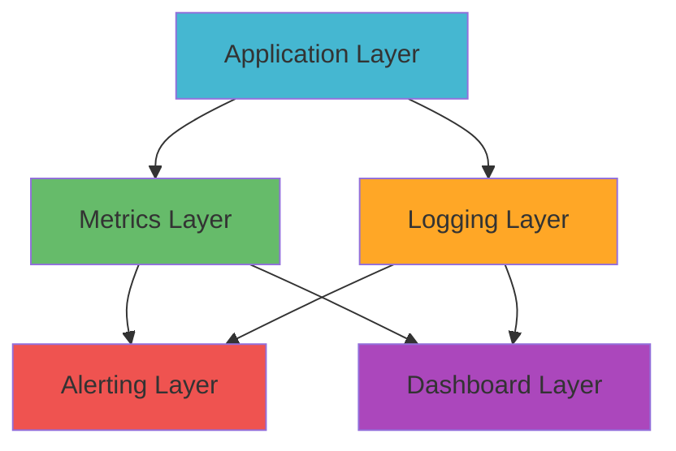

# Monitoring & Observability Guide

> Comprehensive monitoring, logging, and alerting setup for the WOOOD Delivery Date Picker system.

## 📊 Monitoring Overview

The WOOOD Delivery Date Picker implements a multi-layered monitoring strategy to ensure system reliability, performance, and security.

### Monitoring Stack



### Monitoring Pillars

| Pillar | Purpose | Tools | SLA |
|--------|---------|-------|-----|
| **Uptime** | Service availability | Cloudflare Analytics, Pingdom | 99.9% |
| **Performance** | Response times & throughput | Cloudflare Analytics, Custom metrics | <500ms avg |
| **Errors** | Error rates & debugging | Structured logging, Sentry | <1% error rate |
| **Security** | Threat detection & access monitoring | WAF logs, Auth logs | Real-time alerts |
| **Business** | Feature usage & delivery metrics | Custom analytics | Daily reports |

## 🔍 Logging Strategy

### Log Levels

```typescript
enum LogLevel {
  ERROR = 0,    // System errors, exceptions
  WARN = 1,     // Warning conditions
  INFO = 2,     // General information
  DEBUG = 3,    // Debug information
  TRACE = 4     // Detailed tracing
}

// Environment-specific log levels
const logLevels = {
  production: LogLevel.INFO,
  staging: LogLevel.DEBUG,
  development: LogLevel.TRACE
};
```

### Structured Logging

**Log Format**:
```typescript
interface LogEntry {
  timestamp: string;
  level: LogLevel;
  service: string;
  requestId: string;
  userId?: string;
  shopDomain?: string;
  message: string;
  context: Record<string, any>;
  error?: {
    name: string;
    message: string;
    stack: string;
  };
  performance?: {
    duration: number;
    memory: number;
  };
}

// Example log entry
const logEntry: LogEntry = {
  timestamp: "2023-12-01T10:30:00.000Z",
  level: LogLevel.INFO,
  service: "delivery-dates",
  requestId: "req_abc123",
  userId: "user_456",
  shopDomain: "woood.myshopify.com",
  message: "Delivery dates retrieved successfully",
  context: {
    postalCode: "1234AB",
    dateRange: "2023-12-01 to 2023-12-15",
    cacheHit: true
  },
  performance: {
    duration: 145,
    memory: 2048
  }
};
```

### Log Categories

**1. Application Logs**:
```typescript
// Authentication events
logger.info("OAuth callback successful", {
  shopDomain: shop,
  scopes: grantedScopes,
  installationId: installation.id
});

// API requests
logger.info("API request processed", {
  endpoint: "/api/delivery-dates",
  method: "GET",
  statusCode: 200,
  duration: 145
});

// Business events
logger.info("Delivery date selected", {
  orderId: order.id,
  selectedDate: "2023-12-15",
  postalCode: "1234AB",
  shippingMethod: "standard"
});
```

**2. Error Logs**:
```typescript
// System errors
logger.error("DutchNed API error", {
  error: error.message,
  stack: error.stack,
  requestData: sanitizedRequest,
  responseStatus: response.status
});

// Validation errors
logger.warn("Invalid postal code format", {
  postalCode: input.postalCode,
  shopDomain: context.shop,
  userId: context.user.id
});
```

**3. Security Logs**:
```typescript
// Authentication failures
logger.warn("Authentication failed", {
  reason: "invalid_hmac",
  shopDomain: request.headers.shop,
  ipAddress: request.headers.cf_connecting_ip,
  userAgent: request.headers.user_agent
});

// Rate limiting
logger.warn("Rate limit exceeded", {
  ipAddress: clientIP,
  endpoint: request.url,
  requestCount: currentCount,
  windowStart: windowStart
});
```

## 📈 Metrics Collection

### Application Metrics

**Performance Metrics**:
```typescript
interface PerformanceMetrics {
  // Response time metrics
  responseTime: {
    mean: number;
    p50: number;
    p95: number;
    p99: number;
  };
  
  // Throughput metrics
  throughput: {
    requestsPerSecond: number;
    requestsPerMinute: number;
  };
  
  // Error metrics
  errors: {
    errorRate: number;
    errorCount: number;
    errorsByType: Record<string, number>;
  };
  
  // Cache metrics
  cache: {
    hitRate: number;
    missRate: number;
    evictionRate: number;
  };
}
```

**Business Metrics**:
```typescript
interface BusinessMetrics {
  // Delivery date selection metrics
  deliveryDates: {
    selectionsPerDay: number;
    averageLeadTime: number;
    popularDates: string[];
    postalCodeCoverage: number;
  };
  
  // Order processing metrics
  orders: {
    ordersWithDeliveryDate: number;
    orderProcessingTime: number;
    failedOrderProcessing: number;
  };
  
  // Feature usage metrics
  features: {
    adminDashboardLogins: number;
    featureFlagToggles: number;
    apiEndpointUsage: Record<string, number>;
  };
}
```

### Custom Metrics Implementation

**Metrics Collection Service**:
```typescript
class MetricsService {
  private metrics: Map<string, number> = new Map();
  
  // Counter for events
  increment(metric: string, tags?: Record<string, string>): void {
    const key = this.buildMetricKey(metric, tags);
    this.metrics.set(key, (this.metrics.get(key) || 0) + 1);
  }
  
  // Gauge for values
  gauge(metric: string, value: number, tags?: Record<string, string>): void {
    const key = this.buildMetricKey(metric, tags);
    this.metrics.set(key, value);
  }
  
  // Timer for duration
  timer(metric: string, duration: number, tags?: Record<string, string>): void {
    const key = this.buildMetricKey(metric, tags);
    this.recordTiming(key, duration);
  }
  
  // Histogram for distributions
  histogram(metric: string, value: number, tags?: Record<string, string>): void {
    const key = this.buildMetricKey(metric, tags);
    this.recordHistogram(key, value);
  }
}

// Usage examples
const metrics = new MetricsService();

// Request metrics
metrics.increment('http.requests', { endpoint: '/api/delivery-dates', method: 'GET' });
metrics.timer('http.response_time', duration, { endpoint: '/api/delivery-dates' });

// Business metrics
metrics.increment('delivery_dates.selected', { postal_code: '1234AB' });
metrics.gauge('orders.processing_queue', queueLength);
```

## 🚨 Alerting & Notifications

### Alert Definitions

**Critical Alerts** (Immediate response required):
```yaml
critical_alerts:
  - name: "Service Down"
    condition: "uptime < 99%"
    window: "5 minutes"
    notification: ["pagerduty", "slack-critical"]
    
  - name: "High Error Rate"
    condition: "error_rate > 5%"
    window: "5 minutes"
    notification: ["pagerduty", "slack-critical"]
    
  - name: "Security Incident"
    condition: "failed_auth_attempts > 50"
    window: "1 minute"
    notification: ["security-team", "slack-security"]
```

**Warning Alerts** (Monitor and investigate):
```yaml
warning_alerts:
  - name: "Elevated Response Time"
    condition: "response_time_p95 > 1000ms"
    window: "10 minutes"
    notification: ["slack-engineering"]
    
  - name: "Cache Miss Rate High"
    condition: "cache_miss_rate > 30%"
    window: "15 minutes"
    notification: ["slack-engineering"]
    
  - name: "DutchNed API Degraded"
    condition: "external_api_success_rate < 95%"
    window: "10 minutes"
    notification: ["slack-engineering"]
```

### Alert Management

**Alert Routing**:
```typescript
interface AlertRouting {
  critical: {
    channels: ['pagerduty', 'slack-critical'];
    escalation: ['team-lead', 'engineering-manager'];
    timeout: 300; // 5 minutes
  };
  warning: {
    channels: ['slack-engineering'];
    escalation: ['team-lead'];
    timeout: 1800; // 30 minutes
  };
  info: {
    channels: ['slack-monitoring'];
    escalation: [];
    timeout: 0;
  };
}
```

**Alert Suppression**:
```typescript
class AlertSuppressionService {
  // Prevent alert spam during incidents
  suppressSimilarAlerts(alertType: string, windowMinutes: number): boolean {
    const key = `alert_suppression:${alertType}`;
    const lastAlert = this.getLastAlert(key);
    
    if (lastAlert && Date.now() - lastAlert < windowMinutes * 60 * 1000) {
      return true; // Suppress this alert
    }
    
    this.setLastAlert(key, Date.now());
    return false;
  }
}
```

## 📱 Dashboards

### Production Dashboard

**Overview Dashboard Widgets**:
```typescript
const dashboardWidgets = {
  // System health overview
  systemHealth: {
    type: 'status',
    metrics: ['uptime', 'response_time', 'error_rate'],
    timeRange: '24h'
  },
  
  // Request volume and performance
  requestMetrics: {
    type: 'timeseries',
    metrics: ['requests_per_minute', 'response_time_p95'],
    timeRange: '24h'
  },
  
  // Error tracking
  errorTracking: {
    type: 'table',
    metrics: ['error_count', 'error_rate_by_endpoint'],
    timeRange: '24h'
  },
  
  // Business metrics
  businessMetrics: {
    type: 'counter',
    metrics: ['delivery_dates_selected', 'orders_processed'],
    timeRange: '24h'
  }
};
```

### Development Dashboard

**Development Metrics**:
```typescript
const devDashboard = {
  // Build and deployment metrics
  cicd: {
    type: 'status',
    metrics: ['build_success_rate', 'deployment_frequency'],
    timeRange: '7d'
  },
  
  // Code quality metrics
  codeQuality: {
    type: 'gauge',
    metrics: ['test_coverage', 'code_duplication', 'technical_debt'],
    timeRange: '30d'
  },
  
  // Development velocity
  velocity: {
    type: 'chart',
    metrics: ['features_delivered', 'bug_fixes', 'story_points'],
    timeRange: '30d'
  }
};
```

### Real-time Monitoring

**Live Metrics Stream**:
```typescript
class RealTimeMonitoring {
  private metricsStream: EventSource;
  
  startLiveMonitoring(): void {
    this.metricsStream = new EventSource('/api/metrics/live');
    
    this.metricsStream.onmessage = (event) => {
      const metrics = JSON.parse(event.data);
      this.updateDashboard(metrics);
    };
  }
  
  updateDashboard(metrics: any): void {
    // Update dashboard widgets in real-time
    this.updateWidget('response-time', metrics.responseTime);
    this.updateWidget('error-rate', metrics.errorRate);
    this.updateWidget('active-users', metrics.activeUsers);
  }
}
```

## 🔐 Security Monitoring

### Security Event Detection

**Authentication Monitoring**:
```typescript
interface SecurityEvents {
  // Failed authentication attempts
  authenticationFailures: {
    ipAddress: string;
    userAgent: string;
    failureReason: string;
    timestamp: string;
    count: number;
  };
  
  // Suspicious request patterns
  suspiciousActivity: {
    ipAddress: string;
    requestPattern: string;
    riskScore: number;
    timestamp: string;
  };
  
  // Admin access monitoring
  adminAccess: {
    userId: string;
    action: string;
    resource: string;
    ipAddress: string;
    timestamp: string;
  };
}
```

**Threat Detection Rules**:
```typescript
const threatDetectionRules = {
  // Brute force detection
  bruteForce: {
    condition: "failed_auth_attempts > 10 from same IP in 5 minutes",
    action: "block_ip_temporarily",
    duration: "1 hour"
  },
  
  // Anomalous request patterns
  requestAnomaly: {
    condition: "request_rate > 10x normal for endpoint",
    action: "rate_limit_enhanced",
    duration: "30 minutes"
  },
  
  // Geographic anomalies
  geoAnomaly: {
    condition: "admin_access from unusual country",
    action: "require_additional_verification",
    duration: "24 hours"
  }
};
```

### Audit Logging

**Admin Action Auditing**:
```typescript
interface AuditLog {
  timestamp: string;
  userId: string;
  userEmail: string;
  action: string;
  resource: string;
  resourceId: string;
  oldValue?: any;
  newValue?: any;
  ipAddress: string;
  userAgent: string;
  sessionId: string;
}

// Example audit log entries
const auditLogs: AuditLog[] = [
  {
    timestamp: "2023-12-01T10:30:00.000Z",
    userId: "user_123",
    userEmail: "admin@woood.com",
    action: "UPDATE",
    resource: "feature_flag",
    resourceId: "delivery_dates_enabled",
    oldValue: false,
    newValue: true,
    ipAddress: "192.168.1.100",
    userAgent: "Mozilla/5.0...",
    sessionId: "session_456"
  }
];
```

## 🚀 Performance Monitoring

### Response Time Monitoring

**SLA Tracking**:
```typescript
interface SLAMetrics {
  // Response time SLAs
  responseTime: {
    target: 500; // milliseconds
    current: number;
    trend: 'improving' | 'degrading' | 'stable';
  };
  
  // Availability SLAs
  availability: {
    target: 99.9; // percentage
    current: number;
    downtime: number; // minutes this month
  };
  
  // Error rate SLAs
  errorRate: {
    target: 1; // percentage
    current: number;
    trend: 'improving' | 'degrading' | 'stable';
  };
}
```

**Performance Budget**:
```typescript
const performanceBudget = {
  // Response time budgets
  responseTime: {
    '/api/delivery-dates': 200,      // ms
    '/api/order-processing': 500,    // ms
    '/admin/dashboard': 1000,        // ms
    '/health': 50                    // ms
  },
  
  // Cache hit rate budgets
  cacheHitRate: {
    'delivery-dates': 80,    // percentage
    'postal-codes': 95,      // percentage
    'feature-flags': 99      // percentage
  },
  
  // External API response budgets
  externalApis: {
    'dutchned-api': 1000,    // ms
    'shopify-api': 2000      // ms
  }
};
```

### Resource Monitoring

**Cloudflare Workers Metrics**:
```typescript
interface WorkerMetrics {
  // CPU usage
  cpuTime: {
    average: number;        // milliseconds
    peak: number;
    limit: 50;             // milliseconds per request
  };
  
  // Memory usage
  memoryUsage: {
    average: number;        // MB
    peak: number;
    limit: 128;            // MB
  };
  
  // Request count
  requests: {
    perSecond: number;
    perMinute: number;
    dailyTotal: number;
  };
  
  // KV operations
  kvOperations: {
    readsPerSecond: number;
    writesPerSecond: number;
    errorRate: number;
  };
}
```

## 📊 Monitoring Implementation

### Metrics Collection Setup

**Cloudflare Analytics**:
```typescript
// Custom analytics events
class CloudflareAnalytics {
  track(event: string, data: Record<string, any>): void {
    // Send to Cloudflare Analytics
    fetch('/analytics', {
      method: 'POST',
      headers: { 'Content-Type': 'application/json' },
      body: JSON.stringify({
        event,
        data,
        timestamp: Date.now(),
        blobs: [JSON.stringify(data)]
      })
    });
  }
}

// Usage
const analytics = new CloudflareAnalytics();
analytics.track('delivery_date_selected', {
  postalCode: '1234AB',
  selectedDate: '2023-12-15',
  shippingMethod: 'standard'
});
```

**Health Check Implementation**:
```typescript
class HealthCheckService {
  async performHealthCheck(): Promise<HealthStatus> {
    const checks = await Promise.allSettled([
      this.checkDatabase(),
      this.checkExternalAPIs(),
      this.checkCache(),
      this.checkMemoryUsage()
    ]);
    
    return {
      status: checks.every(check => check.status === 'fulfilled') ? 'healthy' : 'unhealthy',
      checks: {
        database: this.getCheckResult(checks[0]),
        externalAPIs: this.getCheckResult(checks[1]),
        cache: this.getCheckResult(checks[2]),
        memory: this.getCheckResult(checks[3])
      },
      timestamp: new Date().toISOString()
    };
  }
}
```

### Monitoring Automation

**Automated Incident Response**:
```typescript
class IncidentResponse {
  async handleCriticalAlert(alert: Alert): Promise<void> {
    // 1. Create incident ticket
    const incident = await this.createIncident(alert);
    
    // 2. Notify on-call engineer
    await this.notifyOnCall(incident);
    
    // 3. Scale resources if needed
    if (alert.type === 'high_load') {
      await this.scaleResources();
    }
    
    // 4. Document incident timeline
    await this.logIncidentEvent(incident, 'automated_response_initiated');
  }
}
```

---

**📊 Monitoring Note**: Effective monitoring is crucial for maintaining system reliability and performance. Regular review and updates of monitoring configurations ensure continued effectiveness as the system evolves.
