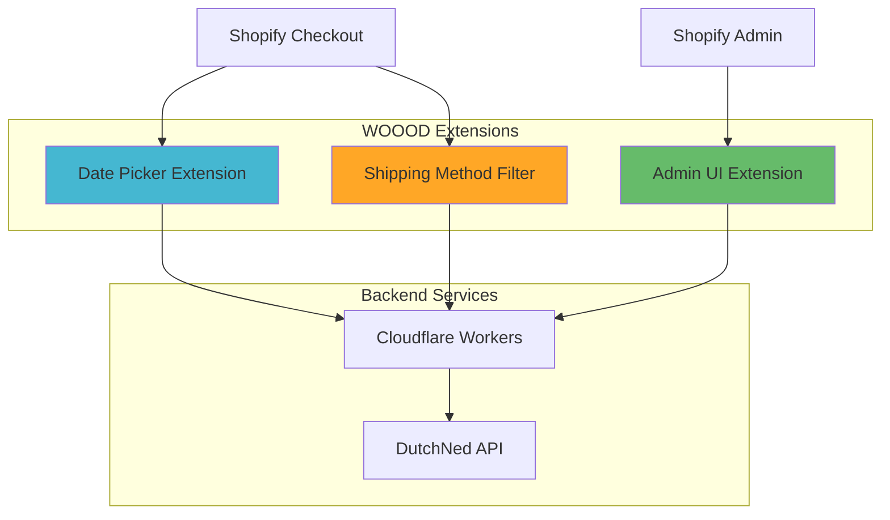

# Shopify Extensions Deployment Guide

> Complete guide for deploying and managing Shopify checkout extensions and app extensions for the WOOOD Delivery Date Picker.

## 🛍️ Extension Overview

The WOOOD Delivery Date Picker includes multiple Shopify extensions that integrate seamlessly with the Shopify checkout and admin experience.

### Extension Architecture



### Extension Types

| Extension | Type | Purpose | Integration Point |
|-----------|------|---------|-------------------|
| **Date Picker** | Checkout UI | Delivery date selection | Checkout information step |
| **Shipping Method Filter** | Function | Filter shipping methods by postal code | Delivery customization |
| **Admin UI** | Admin UI | Configuration dashboard | Shopify Admin |

## 📦 Date Picker Extension

### Extension Configuration

**shopify.extension.toml**:
```toml
api_version = "2023-10"

[[extensions]]
type = "ui_extension"
name = "woood-delivery-date-picker"
handle = "woood-date-picker"

[extensions.metafields]
namespace = "woood"
key = "delivery_date"

[[extensions.settings]]
key = "api_endpoint"
type = "single_line_text_field"
name = "API Endpoint URL"
description = "Cloudflare Workers API endpoint"

[[extensions.settings]]
key = "default_lead_time"
type = "number_integer"
name = "Default Lead Time (days)"
description = "Default lead time when API is unavailable"
```

### Extension Implementation

**index.tsx**:
```tsx
import React, { useState, useEffect } from 'react';
import {
  reactExtension,
  useSettings,
  useCheckoutToken,
  useApplyMetafieldsChange,
  BlockStack,
  Text,
  Select,
  SkeletonText,
  Banner
} from '@shopify/ui-extensions-react/checkout';

export default reactExtension(
  'purchase.checkout.delivery-address.render-after',
  () => <DeliveryDatePicker />
);

function DeliveryDatePicker() {
  const settings = useSettings();
  const checkoutToken = useCheckoutToken();
  const applyMetafieldsChange = useApplyMetafieldsChange();

  const [availableDates, setAvailableDates] = useState<string[]>([]);
  const [selectedDate, setSelectedDate] = useState<string>('');
  const [loading, setLoading] = useState(true);
  const [error, setError] = useState<string | null>(null);

  useEffect(() => {
    loadAvailableDates();
  }, [checkoutToken]);

  const loadAvailableDates = async () => {
    try {
      setLoading(true);
      setError(null);

      const response = await fetch(`${settings.api_endpoint}/api/delivery-dates`, {
        method: 'POST',
        headers: {
          'Content-Type': 'application/json',
          'X-Shopify-Checkout-Token': checkoutToken,
        },
        body: JSON.stringify({
          postalCode: getPostalCode(),
          shippingMethod: getShippingMethod()
        })
      });

      if (!response.ok) {
        throw new Error('Failed to fetch delivery dates');
      }

      const data = await response.json();
      setAvailableDates(data.dates);
    } catch (err) {
      setError('Unable to load delivery dates. Please try again.');
      console.error('Delivery dates fetch error:', err);
    } finally {
      setLoading(false);
    }
  };

  const handleDateChange = async (date: string) => {
    setSelectedDate(date);

    // Apply metafield to the order
    await applyMetafieldsChange({
      type: 'updateMetafield',
      namespace: 'woood',
      key: 'delivery_date',
      valueType: 'string',
      value: date
    });
  };

  if (loading) {
    return (
      <BlockStack spacing="loose">
        <Text size="medium" emphasis="strong">
          Loading delivery dates...
        </Text>
        <SkeletonText inlineSize="small" />
      </BlockStack>
    );
  }

  if (error) {
    return (
      <Banner status="warning">
        <Text>{error}</Text>
      </Banner>
    );
  }

  return (
    <BlockStack spacing="loose">
      <Text size="medium" emphasis="strong">
        Select Delivery Date
      </Text>

      <Select
        label="Choose your preferred delivery date"
        options={availableDates.map(date => ({
          value: date,
          label: formatDisplayDate(date)
        }))}
        value={selectedDate}
        onChange={handleDateChange}
        required
      />

      {selectedDate && (
        <Text size="small" appearance="subdued">
          Your order will be delivered on {formatDisplayDate(selectedDate)}
        </Text>
      )}
    </BlockStack>
  );
}

function getPostalCode(): string {
  // Extract postal code from checkout context
  // Implementation depends on checkout structure
}

function getShippingMethod(): string {
  // Extract shipping method from checkout context
  // Implementation depends on checkout structure
}

function formatDisplayDate(date: string): string {
  return new Date(date).toLocaleDateString('en-NL', {
    weekday: 'long',
    year: 'numeric',
    month: 'long',
    day: 'numeric'
  });
}
```

### Testing the Extension

**Local Development**:
```bash
# Navigate to extension directory
cd extensions/date-picker

# Install dependencies
npm install

# Start development server
shopify app dev

# Test in development store
# Extension will be available at checkout
```

**Testing Checklist**:
- [ ] Extension loads without errors
- [ ] Delivery dates are fetched correctly
- [ ] Date selection updates metafield
- [ ] Error handling works for API failures
- [ ] Loading states display properly
- [ ] Extension works across different browsers

## 🚛 Shipping Method Filter Extension

### Function Configuration

**shopify.extension.toml**:
```toml
api_version = "2023-10"

[[extensions]]
type = "function"
name = "woood-shipping-method-filter"
handle = "shipping-method-filter"

[extensions.build]
command = "npm run build"
path = "dist/index.wasm"

[extensions.ui.paths]
create = "/admin/settings/shipping/methods/create"
details = "/admin/settings/shipping/methods/:id"

[[extensions.targeting]]
target = "purchase.delivery-customization.run"
```

### Function Implementation

**src/index.ts**:
```typescript
import type {
  RunInput,
  FunctionRunResult,
  DeliveryCustomization,
} from '../generated/api';

export function run(input: RunInput): FunctionRunResult {
  const operations: DeliveryCustomization[] = [];

  // Get customer's postal code from shipping address
  const postalCode = input.cart.deliveryAddress?.zip;

  if (!postalCode) {
    // No postal code available, don't filter anything
    return { operations };
  }

  // Filter shipping methods based on postal code
  input.cart.deliveryGroups.forEach((group, groupIndex) => {
    group.deliveryOptions.forEach((option, optionIndex) => {
      if (!isShippingMethodAvailable(option.handle, postalCode)) {
        operations.push({
          hide: {
            deliveryOptionHandle: option.handle,
          },
        });
      }
    });
  });

  return { operations };
}

function isShippingMethodAvailable(methodHandle: string, postalCode: string): boolean {
  // Define postal code coverage for different shipping methods
  const shippingCoverage = {
    'express-delivery': isUrbanArea(postalCode),
    'same-day-delivery': isSameDayZone(postalCode),
    'weekend-delivery': isWeekendZone(postalCode),
    'standard-delivery': true, // Available everywhere
  };

  return shippingCoverage[methodHandle] ?? true;
}

function isUrbanArea(postalCode: string): boolean {
  // Urban areas: 1000-1999, 2000-2999, 3000-3999
  const firstTwo = parseInt(postalCode.substring(0, 2));
  return firstTwo >= 10 && firstTwo <= 39;
}

function isSameDayZone(postalCode: string): boolean {
  // Same-day delivery only in major cities
  const majorCityZones = ['10', '11', '12', '20', '21', '30', '31'];
  return majorCityZones.includes(postalCode.substring(0, 2));
}

function isWeekendZone(postalCode: string): boolean {
  // Weekend delivery available in most urban and suburban areas
  const firstTwo = parseInt(postalCode.substring(0, 2));
  return firstTwo >= 10 && firstTwo <= 59;
}
```

### GraphQL Schema

**schema.graphql**:
```graphql
type Input {
  cart: Cart!
}

type Cart {
  deliveryAddress: DeliveryAddress
  deliveryGroups: [DeliveryGroup!]!
}

type DeliveryAddress {
  zip: String
  city: String
  countryCode: String
}

type DeliveryGroup {
  deliveryOptions: [DeliveryOption!]!
}

type DeliveryOption {
  handle: String!
  title: String!
  cost: Money!
}

type Money {
  amount: String!
  currencyCode: String!
}

type DeliveryCustomization {
  hide: HideOperation
}

type HideOperation {
  deliveryOptionHandle: String!
}
```

## 🎛️ Admin UI Extension

### Extension Setup

**Admin extension configuration** allows merchants to configure delivery settings directly within Shopify Admin.

**package.json**:
```json
{
  "name": "woood-admin-ui",
  "version": "1.0.0",
  "dependencies": {
    "@shopify/admin-ui-extensions": "^2.0.0",
    "@shopify/admin-ui-extensions-react": "^2.0.0",
    "react": "^18.0.0"
  }
}
```

**index.tsx**:
```tsx
import React, { useState, useEffect } from 'react';
import {
  reactExtension,
  useApi,
  AdminBlock,
  BlockStack,
  Text,
  TextField,
  Button,
  Card,
  ChoiceList,
  Banner
} from '@shopify/admin-ui-extensions-react';

export default reactExtension('admin.settings.apps.render', () => <DeliverySettings />);

function DeliverySettings() {
  const { data, refetch } = useApi(
    'admin.graphql',
    {
      query: `
        query getAppSettings {
          appInstallation {
            metafields(first: 10, namespace: "woood_settings") {
              edges {
                node {
                  key
                  value
                }
              }
            }
          }
        }
      `
    }
  );

  const [settings, setSettings] = useState({
    defaultLeadTime: '3',
    enableWeekendDelivery: false,
    enableExpressDelivery: true,
    maxDeliveryRange: '14'
  });

  const [isSaving, setIsSaving] = useState(false);
  const [saveStatus, setSaveStatus] = useState<'success' | 'error' | null>(null);

  const saveSettings = async () => {
    setIsSaving(true);
    setSaveStatus(null);

    try {
      // Save settings to app backend
      const response = await fetch('/api/admin/settings', {
        method: 'POST',
        headers: {
          'Content-Type': 'application/json',
          'X-Shopify-Access-Token': 'ACCESS_TOKEN' // Handled by framework
        },
        body: JSON.stringify(settings)
      });

      if (response.ok) {
        setSaveStatus('success');
      } else {
        setSaveStatus('error');
      }
    } catch (error) {
      setSaveStatus('error');
    } finally {
      setIsSaving(false);
    }
  };

  return (
    <AdminBlock title="WOOOD Delivery Date Settings">
      <BlockStack gap="large">
        {saveStatus === 'success' && (
          <Banner tone="success">
            Settings saved successfully!
          </Banner>
        )}

        {saveStatus === 'error' && (
          <Banner tone="critical">
            Failed to save settings. Please try again.
          </Banner>
        )}

        <Card>
          <BlockStack gap="large">
            <Text variant="headingMd">General Settings</Text>

            <TextField
              label="Default Lead Time (days)"
              type="number"
              value={settings.defaultLeadTime}
              onChange={(value) => setSettings({...settings, defaultLeadTime: value})}
              helpText="Default number of days when delivery dates are unavailable"
            />

            <TextField
              label="Maximum Delivery Range (days)"
              type="number"
              value={settings.maxDeliveryRange}
              onChange={(value) => setSettings({...settings, maxDeliveryRange: value})}
              helpText="Maximum number of days in advance for delivery"
            />

            <ChoiceList
              title="Delivery Options"
              choices={[
                {
                  label: 'Enable Weekend Delivery',
                  value: 'weekend',
                  helpText: 'Allow deliveries on Saturdays and Sundays'
                },
                {
                  label: 'Enable Express Delivery',
                  value: 'express',
                  helpText: 'Enable same-day and next-day delivery options'
                }
              ]}
              selected={[
                ...(settings.enableWeekendDelivery ? ['weekend'] : []),
                ...(settings.enableExpressDelivery ? ['express'] : [])
              ]}
              onChange={(selected) => {
                setSettings({
                  ...settings,
                  enableWeekendDelivery: selected.includes('weekend'),
                  enableExpressDelivery: selected.includes('express')
                });
              }}
            />
          </BlockStack>
        </Card>

        <Button
          variant="primary"
          loading={isSaving}
          onClick={saveSettings}
        >
          Save Settings
        </Button>
      </BlockStack>
    </AdminBlock>
  );
}
```

## 🚀 Extension Deployment

### Development Deployment

**1. Local Development Setup**:
```bash
# Install Shopify CLI
npm install -g @shopify/cli @shopify/theme

# Login to Shopify Partners
shopify auth login

# Create development store
shopify app generate extension

# Start development server
shopify app dev --reset
```

**2. Development Testing**:
```bash
# Test specific extension
cd extensions/date-picker
shopify app dev

# Test in development store
# Navigate to: https://your-dev-store.myshopify.com/checkout
```

### Staging Deployment

**1. Deploy to Development Store**:
```bash
# Deploy all extensions
shopify app deploy --source-control-url=https://github.com/woood/delivery-picker

# Deploy specific extension
shopify app deploy --include=date-picker
```

**2. Version Management**:
```bash
# Create new version
shopify app version create

# List versions
shopify app version list

# Activate version
shopify app version activate --version-id=123456
```

### Production Deployment

**1. App Store Submission**:
```bash
# Prepare for submission
shopify app info

# Create production version
shopify app version create --message="Production release v1.0.0"

# Submit for review
shopify app submit --version-id=123456
```

**2. Partner Dashboard Configuration**:
- App listing details
- Screenshots and videos
- Privacy policy and terms
- Pricing and billing setup
- App distribution settings

### Deployment Checklist

**Pre-Deployment Verification**:
- [ ] All extensions tested in development store
- [ ] Error handling implemented and tested
- [ ] Performance benchmarks met
- [ ] Security review completed
- [ ] Documentation updated
- [ ] Support team trained

**Deployment Steps**:
- [ ] Create new app version
- [ ] Deploy to staging environment
- [ ] Run automated tests
- [ ] Perform manual testing
- [ ] Deploy to production
- [ ] Monitor for issues

## 🔧 Extension Management

### Version Control

**Extension Versioning Strategy**:
```json
{
  "version": "1.2.3",
  "api_version": "2023-10",
  "changelog": {
    "1.2.3": {
      "date": "2023-12-01",
      "changes": [
        "Added postal code validation",
        "Improved error handling",
        "Fixed loading state display"
      ]
    }
  }
}
```

### Configuration Management

**Environment-Specific Settings**:
```typescript
const extensionConfig = {
  development: {
    api_endpoint: 'http://localhost:8787',
    debug_mode: true,
    cache_ttl: 60
  },
  staging: {
    api_endpoint: 'https://staging-api.woood.com',
    debug_mode: true,
    cache_ttl: 300
  },
  production: {
    api_endpoint: 'https://api.woood.com',
    debug_mode: false,
    cache_ttl: 1800
  }
};
```

### Performance Optimization

**Extension Bundle Optimization**:
```bash
# Optimize bundle size
npm run build --production

# Analyze bundle
npx webpack-bundle-analyzer dist/index.js

# Tree shaking optimization
echo "sideEffects: false" >> package.json
```

**Runtime Performance**:
```typescript
// Lazy loading for heavy components
const DeliveryCalendar = React.lazy(() => import('./components/DeliveryCalendar'));

// Memoization for expensive calculations
const availableDates = useMemo(() => {
  return calculateAvailableDates(postalCode, shippingMethod);
}, [postalCode, shippingMethod]);

// Debounced API calls
const debouncedFetchDates = useCallback(
  debounce(fetchDeliveryDates, 300),
  []
);
```

## 🔍 Monitoring & Analytics

### Extension Analytics

**Custom Event Tracking**:
```typescript
// Track extension usage
analytics.track('extension_loaded', {
  extension_name: 'date_picker',
  checkout_id: checkoutToken,
  timestamp: Date.now()
});

// Track user interactions
analytics.track('delivery_date_selected', {
  selected_date: selectedDate,
  postal_code: postalCode,
  shipping_method: shippingMethod
});

// Track errors
analytics.track('extension_error', {
  error_type: error.name,
  error_message: error.message,
  extension_name: 'date_picker'
});
```

### Performance Monitoring

**Extension Performance Metrics**:
```typescript
interface ExtensionMetrics {
  loadTime: number;           // Time to initial render
  apiResponseTime: number;    // API call duration
  userInteractionTime: number; // Time to date selection
  errorRate: number;          // Percentage of failed loads
  conversionRate: number;     // Percentage of completed selections
}
```

## 🔒 Security Considerations

### Data Protection

**Sensitive Data Handling**:
```typescript
// Sanitize postal codes
function sanitizePostalCode(postalCode: string): string {
  return postalCode.replace(/[^0-9A-Z]/gi, '').toUpperCase();
}

// Validate API responses
function validateDeliveryDates(dates: unknown): string[] {
  if (!Array.isArray(dates)) {
    throw new Error('Invalid delivery dates format');
  }

  return dates.filter(date =>
    typeof date === 'string' &&
    isValidDate(date) &&
    isFutureDate(date)
  );
}
```

### CSRF Protection

**Request Authentication**:
```typescript
// Include checkout token in requests
const authenticatedFetch = (url: string, options: RequestInit = {}) => {
  return fetch(url, {
    ...options,
    headers: {
      ...options.headers,
      'X-Shopify-Checkout-Token': checkoutToken,
      'Content-Type': 'application/json'
    }
  });
};
```

---

**🛍️ Extension Note**: Shopify extensions provide powerful integration capabilities. Follow best practices for performance, security, and user experience to ensure successful deployment and adoption.
